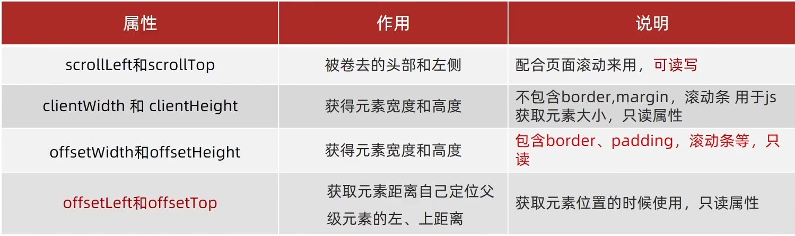
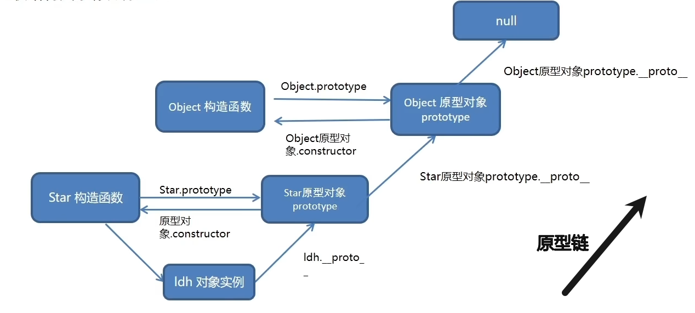

## JavaScript基础
 ### JavaScript组成
  - ECMAScript 规定了JS基础语法核心知识。
  - Web APIs 
    - DOM 操作文档，页面元素的移动、大小、增删改查等
    - BOM 操作浏览器，页面的弹窗、高度检测、存储数据等
 ### 输入输出语法
  - 输出语法
    - `document.write('')` 向body中写内容，可以【写字】；也可以写【标签】
    - `alert('')` 弹出警告对话框
    - `console.log('')` 控制台输出
  - 输入语法
    - `prompt('')`  显示对话框，提示用户输入
 ### 字面量
  - 字面量（literal）是计算机中描述 事/物
  - 1000-数字字面量/'程序员'-字符串字面量/[]-数组字面量/{}-对象字面量...
 ### 变量 `let`
  - 变量就是计算机用来存储数据的容器
  - 变量的初始化：声明（let） + 赋值（=）
 ### 常量 `const`
  - 不允许重新赋值
  - 声明的时候必须初始化
 ### 数组
  - 取值：数组名[下标]
 ### 模板字符串
  - `数字${}个` 外面用反引号包裹，里面 ${变量名}
 ### 数据类型
  - 基本：number数字型|string字符型|boolean布尔型|undefined未定义型|null空类型
  - 引用：Object对象
  - 检测数据类型 `typeof`
    1. 作为运算符：`typeof x`
    2. 函数形式：`typeof(x)`
 ### 数据类型转换
  - 隐式转换：算术运算符都会进行隐式转换
  - 显式转换：
    - 数字型
      1. `Number(数据)`
      2. `parseInt(数据)` 只保留整数
      3. `parseFloat(数据)` 可以保留小数
 ### 运算符
  - 赋值运算符：对变量进行赋值的运算符
    - `+= -= *= /= %=`
  - 一元运算符：自增 自减
    - 自增：`++` 变量值+1
    - 自减：`--` 变量值-1
  - 比较运算符
    - `> < >= <= == === !==`
  - 逻辑运算符
    - `&&` 与 并且 一假全假
    - `||` 或 或者 一真全真
    - `!`  非 取反
 ### 分支语句
  - if-else语句：单分支、双分支、多分支
  - 三元运算符：`条件 ? 满足执行的代码 : 不满住执行的代码`
  - switch语句
    - 当`数据 === 值`才执行对应的语句
    ```JavaScript
    switch(数据) {
      case 值1:
          代码1
          break
      case 值2:
          代码2
          break
      default:
          代码n
          break
    }
    ```
 ### 循环语句
  - while 循环
    - 循环三要素
      1. 变量的起始值
      2. 终止条件
      3. 变量的变化量
      ```JavaScript
      let i = 1
      while(i <= 3) {
        document.write('循环3次')
        i++
      }
      ```
  - 循环退出
    - break：退出循环
    - continue：结束本次循环，继续下次循环
  - for循环
 ### 数组
  - 数组（Array）：是一种可以按顺序保存数据的数据类型
  - 使用：（所以或者下标都是从0开始）
    1. 声明数组 `let arr = [1,2,'A',true]` `let arr = new Array(1,2,'A',true)`
    2. 取值语法 `数组名[下标]`
    3. 遍历数组 
       ```js
       let arr = [1,2,3,4,5,6]
       for (let i = 0 ;i < arr.length; i++) {
        console.log(arr[i]);
       }
       ```
  - 数组的操作
    - 增：`arr.push()`末尾 `arr.unshift()`开头
    - 删：`ar.pop()`末尾 `arr.shift()`开头 `arr.splice(操作的下标，删除的个数)`
    - 改：`数组[下标] = 新值`
    - 查：`数组[下标]`
  - map方法
    - 遍历数组，对每个元素进行操作，返回一个新数组
      ```js
      // 假设有一个数组
      const arr = [1,2,3,4,5]
      // 假设要对这个数组每个元素乘以2
      arr.map(function(item,index){
        return item * 2
      }
      ```
  - join方法
    - 将数组转换为字符串
      ```js
      const arr = [1,2,3,4,5]
      const str1 = arr.join() // 默认以逗号分隔 1,2,3,4,5
      const str2 = arr.join('-') // 以-号分隔 1-2-3-4-5
      ```
  - forEach方法
    - 遍历数组的每个元素
      ```js
      // 基本语法
      arr.forEach(function(item,index){
        console.log(item,index)
      })
      ```
  - fliter方法
    - 遍历数组，返回符合条件的元素
      ```js
      // 假设有一个数组
      const arr = [1,2,3,4,5]
      // 假设要找到数组中大于2的元素
      const arr2 = arr.filter(function(item,index){
        return item > 2
      }
      ```
 ### 函数
  - 函数的声明
    ```js
    function 函数名称 (形参) {
      函数体
    }
    ```
  - 函数的调用
    ```js
    函数的名称(实参)
    ```
  - 函数的返回值
    - `ruturn`可以返回单个数据，多个数据用数组，也可以结束代码
  - 匿名函数和函数表达式
    1. 具名函数的调用可以写在任何位置
    2. 匿名函数必须先声明后调用
        ```js
        // 函数表达式，匿名函数
        let fn = function () {}
        // 具名函数
        function fn () {}
        ```
  - 立即执行函数：避免全局变量的污染
    ```js
    // 多个立即执行函数需要用`;`隔开
    // 写法一
    (function(){})();
    // 写法二
    (function(){}());
    ```
 ### 逻辑中断
  - 逻辑中断`&&` `||`
    1. `&&` 左边为false就短路 前面为真输出后面，前面为假输出前面
    2. `||` 右边为true就短路  前面为真输出前面，前面为假输出后面
        ```js
        function getSum(x,y) {
          // 当形参x，y没有实参传入时，默认则设置为0
          x = x || 0
          y = y || 0
          console.log(x + y)
        }
        getSum(1,2)
        ```
 ### 对象
  - 对象的声明
    1. let 对象名 = {}
    2. let 对象名 = new Object()
  - 对象的使用
    - 属性
    - 方法
      ```js
      let 对象名 = {
        属性名:属性值1,属性值2,'对象名称-A':'名称A',...;
        方法名:函数
      } 
      ```
  - 对象的增删改查
   - 查询`对象名.属性` `对象名['属性名称']`
   - 修改`对象名.属性 = 新值`
   - 增加`对象名.新属性 = 新值`
   - 删除`delete 对象名.属性`（严格模式无法使用）
  - 对象的遍历
   - `for (...in...)`
      ```js
      let obj = {
        uname:'A',
        age:8,
        num:12
      }
      // 遍历对象
      for (let key in obj) {
        // key是属性名，字符串类型带''
        // 取值obj[key]
        console.log(obj[key])
      }
      ```
  - 随机数`Math.random()`
   - 生成N-M之间的随机整数
   - `Math.floor(Math.random() * (M - N + 1)) + N`

## APIs
 ### DOM和BOM
   - DOM（文档对象模型|操作网页内容）、BOM（浏览器对象模型）
 ### DOM
   - DOM（文档对象模型|操作网页内容）
   - DOM树：文档树直观的体现了标签与标签之间的关系
   - DOM对象：浏览器根据html标签生成的js对象
      - document对象：网页所有的内容都在document里面
  #### 获取DOM对象
  - 使用CSS选择器获取DOM元素
     1. `document.querySelector('CSS选择器')` 选择匹配的第一个元素————返回一个对象
     2. `document.querySelectorAll('CSS选择器')` 选择所有的元素—————返回一个对象数组集合
  - 使用其他方法获取DOM元素
     1. `document.getElementById('')` 根据id获取一个元素
     2. `document.getElementByTagName('')` 根据标签获取一类元素
     3. `document.getElementByClassName('')` 根据类名获取一类元素
  #### 操作元素内容
  - 对象.innerText属性
     - 将文本内容添加/更新到任意标签位置
     - 显示纯文本，不解析标签
  - 对象.innerHtml属性
     - 将文本内容添加/更新到任意标签位置
     - 会解析标签，多标签建议使用模板字符
  #### 操作元素的属性
  - 操作元素常用属性
     - 语法：`对象.属性 = 值`
  - 操作元素样式属性
     1. `对象.style.样式属性 = '值'` 通过style属性操作CSS
     2. `对象.className = '类名'` 通过添加类名（className）操作CSS，会覆盖之前标签的类名
     3. 通过classList操作类控制CSS
       - 增加类名 `对象.classList.add('类名')`
       - 删除类名 `对象.classList.remove('类名')`
       - 切换类名 `对象.classList.toggle('类名')`
  - 操作表单元素属性
     - 语法：`DOM对象.属性名 = 值`
     - 只接受布尔值 `对象.checked = true/false`勾选 `对象.disable = true/false`禁用
  - 自定义属性
     - 以`data-自定义名称`命名
     - 获取：`对象.dataset.自定义名称`
  #### 定时器
  1. `setInterval(函数/函数名,间隔时间)` 开启定时器
     - 返回的是一个单独的ID序号
     - 作用：每隔一段时间调用这个函数
     - 间隔时间单位是毫秒
  2. `clearInterval(变量名)` 关闭定时器
     ```js
     //返回的是一个单独的ID序号
     let 变量名 = setInterval(函数,间隔时间)
     // 停止定时器
     clearInterval(变量名)
     // 重新开启定时器
     变量名 = setInterval(函数,间隔时间)
     ```
  #### 事件监听
  - 事件：用户在页面触发的行为
  - 事件监听：给元素添加事件，当事件触发时执行相应的代码
    - 事件监听三要素：
      - 事件源：触发事件的元素
      - 事件类型：触发事件的行为
      - 事件处理程序：触发事件后要执行的代码（函数）
    - 语法：`对象.addEventListener('事件名',函数,是否捕获)`
      - 事件名：on开头的事件，如onclick
      - 函数：事件触发时执行的函数
      - 是否捕获：布尔值，默认是false，不捕获
    - 移除事件监听：`对象.removeEventListener('事件名',函数,是否捕获)`
  - 事件类型
    - 鼠标事件
      - `click` 鼠标点击
      - `mouseenter` 鼠标进入
      - `mouseleave` 鼠标离开
    - 键盘事件
      - `keydown` 键盘按下
      - `keyup` 键盘抬起
    - 表单事件
      - `focus` 获得焦点
      - `blur` 失去焦点
      - `change` 失去焦点时触发
      - `input` 内容改变时触发
    - 页面事件
      - `load` 页面加载完成
      - `unload` 页面关闭
      - `resize` 窗口大小改变
      - `scroll` 滚动条滚动
  - 事件对象
    - 事件对象是事件发生时，系统自动创建的一个对象，包含了事件相关的信息
    - 在事件绑定的函数中，默认有一个事件对象`event/e/ev`
       ```js
       // 获取事件对象
       元素.addEventListener('事件名',function(event){
           console.log(event)
       })
       ```
    - 事件对象中的常用属性
       - `event.target` 返回触发事件的元素
       - `event.type` 返回事件类型
       - `event.clientX` 返回鼠标指针的水平坐标（相当于浏览器可视窗口）
       - `event.clientY` 返回鼠标指针的垂直坐标（相当于浏览器可视窗口）
       - `event.key` 返回键盘键的字符
       - `event.offsetX` 返回鼠标指针的水平坐标（相当于事件源元素）
       - `event.offsetY` 返回鼠标指针的垂直坐标（相当于事件源元素）
  - 环境对象
    - 环境对象是事件发生时，系统自动创建的一个对象，包含了事件相关的信息
    - 在事件绑定的函数中，默认有一个环境对象`this`
       ```js
       // 获取环境对象
       元素.addEventListener('事件名',function(event){
           console.log(this)
       })
       ```
  - 回调函数
    - 函数A作为参数传递给函数B时，我们称函数A为回调函数
    - 回调函数是事件发生时，系统自动调用的函数
    - 回调函数的参数
       - `event` 事件对象
       - `this` 环境对象
    - 回调函数的返回值
       - 返回值会作为事件处理函数的返回值
  - 事件流
    - 事件流描述的是从页面中接收事件的顺序
    - 事件流分为三个阶段
       - 事件捕获阶段
         - 从`document`开始，依次向下传播到目标元素
       - 处于目标阶段
         - 事件到达目标元素，触发目标元素的响应函数
       - 事件冒泡阶段
         - 从目标元素开始，依次向上传播到`document`
    - 阻止冒泡和捕获
       - `事件对象[event/e/ev].stopPropagation()` 阻止冒泡
    - 事件解绑
       - L0事件解绑
         - `元素.onclick = null`
       - L2事件解绑
         - `元素.removeEventListener('事件名',回调函数)`
  - 事件委托
    - 事件委托的原理
       - 不是每个子节点单独设置事件监听器，而是事件监听器`设置在其父节点`上，然后利用冒泡原理影响设置每个子节点
    - 事件委托的优点
       - 省去了为每个子节点添加事件监听器的工作
       - `事件对象[event/e/ev].target`来获取触发事件的全部子节点对象
       - `事件对象[event/e/ev].target.tagName`来获取触发事件的对应的子节点对象
  - 阻止默认行为
    - `event对象[event/e/ev].preventDefault()`
    - `return false`
  - 其他事件
    1. 页面加载事件
      - `DOMContentLoaded` 页面加载完成，不包括样式表、图片、flash等（给document添加）
      - `load` 页面加载完成，包括样式表、图片、flash等（给window添加）
    2. 元素滚动事件
      - `scroll` 元素滚动条滚动
        - 监听整个页面滚动
          - 获取Html元素写法 `document.documentElement`
          ```js
          window.addEventListener('scroll',function(){
              console.log('滚动了')
          })
          ```
        - 监听某个元素滚动
          - `scrollLeft` 元素水平滚动条的位置
          - `scrollTop` 元素垂直滚动条的位置
          ```js
          元素.addEventListener('scroll',function(){
              console.log('滚动了')
          })
          ```
    3. 页面尺寸事件
      - `resize` 窗口大小改变
        ```js
        // 监听整个页面尺寸改变
        window.addEventListener('resize',function(){
            console.log('窗口大小改变了')
        })
        // 监听某个元素尺寸改变
        元素.addEventListener('resize',function(){
            console.log('窗口大小改变了')
        })
        ```
      - 获取元素宽高（不包含边框、margin、滚动条等）
        - `clientWidth` 元素可视区的宽度
        - `clientHeight` 元素可视区的高度 
      - 获取元素宽高（包含边框、margin、滚动条等）
        - `offsetWidth` 元素可视区的宽度
        - `offsetHeight` 元素可视区的高度
  - 元素尺寸与位置
    1. 获取元素宽高（包含边框、margin、滚动条等）
       - `offsetWidth` 元素可视区的宽度
       - `offsetHeight` 元素可视区的高度
    2. 获取元素位置
       - `offsetLeft` 元素相对于其定位父元素的水平偏移量
       - `offsetTop` 元素相对于其定位
       - `element.getBoundingClientRect()` 返回元素的大小及其相对于视口的位置
    
  #### 日期对象
  - 实例化（new）
    - `const date = new Date()`获取当前时间
    - `const date = new Date('2020-11-25 12:0:0')`获取指定时间
  - 日期对象的方法
    - `getFullYear()` 获取当前日期的年份
    - `getMonth()` 获取当前日期的月份（0-11）
    - `getDate()` 获取当前日期的天数（1-31）
    - `getDay()` 获取当前日期的星期几（0-6）
    - `getHours()` 获取当前日期的时
    - `getMinutes()` 获取当前日期的分
    - `getSeconds()` 获取当前日期的秒
    - `getMilliseconds()` 获取当前日期的毫秒
    - `toLocalString()` 获取当前日期的本地字符串表示
    - `toLocaleDateString()` 获取当前日期的本地日期字符串表示
    - `toLocaleTimeString()` 获取当前日期的本地时间字符串表示
  - 时间戳
    - 解释：时间戳是指从1970年1月1日00:00:00 UTC到当前时间所经过的毫秒数
    - 方法1 `getTime()`
      ```js
      const date = new Date()
      // 当前时间戳
      const timestemp =  date.getTime()
      // 指定时间戳
      const timestemp =  new Date('2020-11-25 12:0:0').getTime()
      ```
    - 方法2 `Date.now()`
      ```js
      // 当前时间戳
      const timestemp = Date.now()
      ```
    - 方法3 `+new Date()`
      ```js
      // 当前时间戳
      const timestemp = +new Date()
      // 指定时间戳
      const timestemp =  +new Date('2020-11-25 12:0:0')
      ```
  #### 节点操作
  - DOM节点：DOM树里每一个内容都称之为节点
    - 元素节点：所有的标签
    - 属性节点：所有的属性
    - 文本节点：所有的文本
  - 查找节点（元素节点）
    - 父节点查找
      - `子元素.parentNode` 获取当前节点的父节点
    - 子节点查找
      - `父元素.children` 获取当前节点的所有子元素节点
      - `父元素.childNodes` 获取当前节点的所有子节点
    - 兄弟节点查找
      - `节点.previousSibling` 获取当前节点的上一个兄弟节点
      - `节点.nextSibling` 获取当前节点的下一个兄弟节点
    - 创建节点
      - `document.createElement(标签名)` 创建一个元素节点
      - `document.createTextNode(文本内容)` 创建一个文本节点
    - 增加节点
      - `父元素.appendChild(子元素)` 向父节点的子节点列表末尾添加一个新的子节点
      - `父元素.insertBefore(新节点, 旧节点)` 在父节点的子节点列表中，将新节点插入到旧节点的前面
    - 克隆节点
      - `节点.cloneNode(true)` 克隆一个节点，如果传入true，则表示克隆当前节点及其所有子节点，如果传入false，则表示克隆当前节点及其所有子节点
    - 删除节点
      - `父元素.removeChild(子元素)` 删除父节点下的子节点
  #### M端事件（移动端）
  - 触摸touch事件
    - `touchstart` 触摸开始
    - `touchmove` 触摸移动
    - `touchend` 触摸结束
  #### JS插件
  - swiper插件
 ### BOM
  - 浏览器对象模型
  - 浏览器对象
    - `window` 浏览器窗口对象
      - `document` 文档对象
      - `navigator` 浏览器对象
      - `screen` 屏幕对象
      - `location` 地址栏对象
      - `history` 历史记录对象
  #### window对象
  - 定时器-延时函数
    - 定时器
      - `setTimeout(回调函数, 延时时间)` 延时时间后执行一次回调函数
      - `setInterval(回调函数, 延时时间)` 每隔延时时间执行一次回调函数
      - `clearTimeout(定时器名称)` 清除延时定时器
      - `clearInterval(定时器名称)` 清除延时定时器
  - JS执行机制
    - 单线程：JS是单线程语言，只能同时做一件事
    - 同步任务和异步任务
      - 同步任务：在主线程上排队执行的任务，只有前一个任务执行完，才能执行后一个任务
      - 异步任务：不进入主线程、而进入"任务队列"（task queue）的任务，只有"任务队列"通知主线程，某个异步任务可以执行了，该任务才会进入主线程执行
    - 执行机制：同步和异步任务分别进入不同的执行"场所"，同步的进入主线程，异步的进入"任务队列"。
    - 事件循环：浏览器会通过"事件循环"机制来处理这些任务，即在主线程上执行同步任务，然后浏览器会从"任务队列"中读取事件，然后把对应的异步任务添加到主线程中，被主线程执行，主线程不断重复上面的第三步。
      - 主线程->任务队列->读取事件->步任务添加到主线程->主线程
  - location对象
    - `location.href` 获取或设置整个URL
    - `location.search` 获取或设置URL中的查询串（?后面部分）
    - `location.hash` 获取或设置URL中的hash值（#后面部分）
    - `location.reload()` 重新加载当前页面（true强制刷新）
    - `location.host` 获取主机名和端口号
    - `location.port` 获取端口号
    - `location.pathname` 获取URL中的路径部分
  - navagator对象
    - `navigator.userAgent` 获取浏览器信息
      ```js
      // 检测userAgent浏览器版本以及平台
      !(function(){
        const userAgent = navigator.userAgent
        // 验证是否为Android或者iPhone
        const android = userAgent.match(/(Android);?[\s\/]+([\d.]+)?/)
        const iphone = userAgent.match(/(iPhone\sOS)\s([\d_]+)/)
        //如果是Android或者iPhone，则跳转到移动端站点
        if(android || iphone){
          location.href = 'https://m.example.com'
        }
      })();
      ```
  - screen对象
    - `screen.width` 获取屏幕宽度
    - `screen.height` 获取屏幕高度
  - history对象
    - `history.back()` 回退
    - `history.forward()` 前进
    - `history.go(1)` 前进1步
    - `history.go(-1)` 后退1步
    - `history.go(0)` 刷新
  #### 本地存储
  - 本地存储介绍
    - 本地存储是HTML5提供的一种在客户端存储数据的新方法，它具有永久性，也就是说，只要关闭网页或者浏览器，存储的数据不会被删除。
    - 本地存储的目的是克服由cookie所带来的一些限制，当数据需要被严格控制在客户端上时，无须持续地将数据发回服务器。
  - 本地存储分类-localStorage和sessionStorage
    - `localStorage`用于长久保存整个网站的数据，保存的数据没有过期时间，直到手动去除。
      - 存储数据：`localStorage.setItem(key,value)`
      - 获取数据：`localStorage.getItem(key)`
      - 删除数据：`localStorage.removeItem(key)`
      - 删除所有数据：`localStorage.clear()`
      - 得到某个索引的key：`localStorage.key(index)`
    - `sessionStorage`用于临时保存同一窗口(或标签页)的数据，在关闭窗口或标签页之后将会删除这些数据。
      - 存储数据：`sessionStorage.setItem(key,value)`
      - 获取数据：`sessionStorage.getItem(key)`
      - 删除数据：`sessionStorage.removeItem(key)`
      - 删除所有数据：`sessionStorage.clear()`
      - 得到某个索引的key：`sessionStorage.key(index)`
  - 存储复杂数据类型
    - 存储复杂数据类型，需要使用`JSON.stringify(复杂数据类型)`方法将复杂数据类型转换为字符串，再存储到本地存储中。
    - 转换为对象：`JSON.parse(localStorage.getItem(key))`

## 正则表达式
 ### 正则表达式
  - 正则表达式是用于匹配字符串中字符组合的模式。
  - 作用
    - 表单验证
    - 过滤敏感词
    - 字符串中提前部分内容
  - 语法
    - `const 变量名 = /正则表达式/`
    - `变量名.test(字符串)` 判断是否匹配成功，返回true或者false
    - `变量名.exec(字符串)` 索引是否匹配成功，有就返回数组，没有就返回null
  - 修饰符
    - `i` 忽略大小写
    - `g` 全局匹配
    - `m` 多行匹配
    - `字符串.replace(/正则表达式/,'替换内容')` 替换匹配成功的部分
  - 元字符
    - 边界符
      - `^` 匹配字符串开始的位置
      - `$` 匹配字符串结束的位置
    - 量词符 
      - `*` 匹配前面的子表达式零次或多次（>= 0）
      - `+` 匹配前面的子表达式一次或多次（>= 1）
      - `?` 匹配前面的子表达式零次或一次（0 || 1）
      - `{n}` 精确匹配n次（=== n）
      - `{n,m}` 匹配n到m次（>= n && <= m）
      - `{n,}` 匹配n次或多次（>= n）
    - 字符类
      - `[]` 匹配方括号中列举的字符
      - `[a-z]` 匹配a到z之间的任意小写字母
      - `[^a-z]` 匹配除了a到z之间的任意小写字母
      - `[0-9]` 匹配0到9之间的任意数字
      - `[^0-9]` 匹配除了0到9之间的任意数字
    - 预定义类
      - `\d` 匹配数字
      - `\D` 匹配非数字
      - `\w` 匹配字母或数字或下划线
      - `\W` 匹配非字母或数字或下划线
      - `\s` 匹配空格
      - `\S` 匹配非空格

## JavaScript进阶
 ### 作用域
  - 局部作用域
    - 函数作用域：在函数内部声明的变量只能在函数内部被访问，外部无法直接访问
      1. 函数的参数也是函数内部的局部变量
      2. 函数执行完成后内部的变量实际被清空了
    - 块级作用域：在代码块内部声明的变量，只能在代码块内部被访问，外部无法直接访问
      1. 代码块：`{}`
      2. let和const声明的变量具有块级作用域
      3. var声明的变量没有块级作用域
      4. 不同代码块之间的变量无法互相访问
  - 全局作用域
    - 全局变量：在全局作用域中声明的变量，可以在全局任意位置被访问
  - 作用域链
    - 作用域链本质：变量查找机制
    - 函数被执行时，优先查找当前的函数作用域中的变量
    - 如果当前作用域找不到则会依次查找父级作用域直到全局作用域
      1. 相同作用域链中按照从小到大的规则查找变量
      2. 子作用域可以访问父作用域的变量，父作用域无法访问子作用域的变量
  - JS垃圾回收机制
    - 内存的生命周期
      1. 内存分配：当我们声明变量、函数、对象的时候，系统会自动分配内存
      2. 内存使用：读写内存，变量的使用或者函数的使用
      3. 内存回收：使用完毕后，由垃圾回收机制自动回收不在使用的内存
    - 全局变量一般不会回收（关闭页面回收）
    - 一般情况下局部变量的值，不用了，会被自动回收掉
    - 内存泄漏：程序中分配的内存由于某种原因程序未释放或无法释放，导致系统内存变少
    - 垃圾回收算法
      - 引用计数：
        1. 给对象定义一个引用计数器，每当有一个地方引用它时，计数器值就加1
        2. 当引用失效时，计数器值就减1
        3. 当计数器值为0时，表示对象不再被引用，就可以被回收
        4. 优点：可以很快地发现垃圾
        5. 缺点：无法回收循环引用的对象
      - 标记清除：从根部扫描对象，能查找到的就是使用的，查找不到的就是要回收的
        1. 标记：垃圾回收器将所有活动对象打上标记
        2. 清除：将没有标记的对象清除
        3. 优点：可以回收循环引用的对象
        4. 缺点：效率较低
  - 闭包
    - 闭包：一个函数对周围状态的引用捆绑在一起（或者说函数被引用状态封闭起来），这样的函数称为闭包
    - 闭包 = 内层函数 + 外层函数的变量
      ```js
      // 闭包实例
      function fn1() {
        // 外层函数的变量
        let a = 2

        function fn2() {
          // 内层函数使用了外层函数的变量
          console.log(a)
        }
        // 外层函数中调用了内层函数
        return fn2
      }
      fn1() // 2
      ```
    - 作用：外部可以访问函数内部的变量
    - 实现数据的私有
      ```js
      // 实现数据的私有
      function fn() {
        let i = 0
        function fun2() {
        i++
        console.log(`函数被调用了${i}次`)
        }
        return fun2
      }
      const f = fn()
      f() // 函数被调用了1次
      f() // 函数被调用了2次
      f() // 函数被调用了3次
      ```
    - 缺点：
      - 函数执行完后，函数内的变量没有释放，占用内存时间会变长
      - 容易造成内存泄漏
  - 变量提升
    - 变量提升：将变量的声明提升到它所在作用域的最顶端
 ### 函数进阶
  - 函数提升：将函数的声明提升到它所在作用域的最顶端
    1. 函数的提升可以使函数的声明调用更加灵活
    2. 函数表达式不存在提升现象
  - 函数参数
    - 动态参数
      - `arguments`:是函数内部内置的伪数组变量，它包含了调用函数时传入的所有参数
    - 剩余参数
      - `...xxx`:允许我们将一个不定数量的参数表示为一个数组
  - 箭头函数
    - 基本语法
      ```js
      // 箭头函数
      const fn = (参数1,参数2) => {
        // 函数体
      }
      // 一个参数，一行代码
      const fn = 参数1 => 代码
      // 没有参数，一行代码
      const fn = () => 代码
      // 可以之间返回一个对象
      const fn = () => ({name: 'zs'})
      ```
    - 函数参数
      - 没有`arguments`
      - 有剩余函数`...xxx`
    - 函数this
      - 箭头函数没有自己的this，箭头函数的this继承于外层函数的this
 ### 解构赋值
  - 数组解构
    - 基本语法
      ```js
      const arr = [1,2,3]
      const [a,b,c] = arr
      ```
    - 应用场景
      - 交换变量的值
        ```js
        let a = 1 
        let b = 2;
        [a,b] = [b,a]
        ```
  - 对象解构
    - 直接改名：`旧变量名:新变量名`
    - 基本语法
      ```js
      const obj = {
        name: 'zs',
        age: 18,
        height: 1.88
      }
      const {name,age,height} = obj
      ```
    - 应用场景
      - 多级对象解构
        ```js
        const obj = {
          name: 'zs',
          age: 18,
          height: 1.88,
          info: {
            gender: '男',
            address: '北京'
          }
        }
        const {name,age,height,info: {gender,address}} = obj
        ```
      - 提取json数据
        ```js
        const jsonData = {
          name: 'zs',
          age: 18,
          height: 1.88
        }
        const {name,age,height} = jsonData
        ```
      - 函数参数
        ```js
        function fn({name,age,height}){
          console.log(name,age,height)
        }
        fn({name: 'zs',age: 18,height: 1.88})
        ```
 ### 深入对象
  - 创建对象的三种方法
    1. 利用对象字面量
       ```js
       const obj = {
         name: 'zs'
       }
       ```
    2. 利用new Object()
       ```js
       const obj = new Object({
         name: 'zs'
       })
       ```
    3. 利用构造函数
       ```js
       function Person(name,age){
         this.name = name
         this.age = age
       }
       const obj = new Person('zs',18)
       ```
  - 构造函数
    - 一种特殊的函数，原来初始化对象
    ```js
       function Person(name,age){
         this.name = name
         this.age = age
       }
       const obj = new Person('zs',18)
    ```
    - 实例化过程
      1. 创建新对象
      2. 构造函数this指向新对象
      3. 执行构造函数代码，修改this，添加新的属性
      4. 返回新对象
  - 实例成员&静态成员
    - 实例成员：通过构造函数创建的对象称为实例对象，实例对象中的属性和方法称为实例成员（实例属性和实例方法）
      1. 为构造函数传入参数，创建结构相同但值不同的对象
      2. 构造函数创建的实例对象彼此独立互不影响
    - 静态成员：构造函数本身拥有的属性和方法称为静态成员（构造函数属性、构造函数方法）
      1. 静态成员只能通过构造函数名访问
      2. 静态方法中的this指向构造函数
 ### 内置构造函数
  - Object
    - `Object.keys`静态方法获取对象所有属性名
    - `Object.values`静态方法获取对象所有属性值
    - `Object.assign(目标对象，拷贝对象)`静态方法将一个或多个源对象的所有可枚举属性复制到目标对象
  - Array
    - `Array.forEach`遍历数组；不返回任何值
    - `Array.map`遍历数组；返回一个新数组，不改变原数组
    - `Array.filter`遍历过滤数组；返回一个符合条件的新数组，不改变原数组
    - `Array.reduce`遍历累加数组；返回一个最终结果，不改变原数组
      ```js
      const arr = [1,2,3,4,5]
      // 1. 没有初始值
      const total = arr.reduce(function(prev,current){
        return prev + current
      })
      console.log(total) // 15
      // 2. 有初始值（数组内加完后，还要加上初始值）
      const total = arr.reduce(function(prev,current){
        return prev + current
      },10)
      console.log(total) // 25
      // 箭头函数
      const total = arr.reduce((prev,current)=>prev + current,10)
      console.log(total) // 25
      ```
    - `Array.join`数组元素拼接成字符串；返回一个字符串，不改变原数组
    - `Array.find`遍历数组，返回第一个符合条件的元素，没有找到返回undefined；不改变原数组
    - `Array.every`遍历数组，返回一个布尔值，数组中所有元素都符合条件返回true，否则返回false；不改变原数组
    - `Array.some`遍历数组，返回一个布尔值，数组中只要有一个元素符合条件返回true，否则返回false；不改变原数组
    - `Array.sort`数组排序；返回一个排序后的数组，不改变原数组
    - `Array.split`字符串分割成数组；返回一个分割后的数组，不改变原数组
    - `Array.from`类数组转换成数组；返回一个转换后的数组，不改变原数组
  - String
    - `String.length`获取字符串长度
    - `String.split('分隔符')`字符串分割成数组；返回一个分割后的数组，不改变原字符串
    - `String.substring(截取的起始位置, 截取的结束位置)`截取字符串；返回一个截取后的字符串，不改变原字符串
    - `String.startWith('要判断的字符串')`判断字符串是否以指定字符串开头；返回一个布尔值，是返回true，否返回false，不改变原字符串
    - `String.includes('要判断的字符串')`判断字符串是否包含指定字符串；返回一个布尔值，是返回true，否返回false，不改变原字符串
    - `String.toUpperCase()`字符串转换大写；返回一个转换后的字符串，不改变原字符串
    - `String.toLowerCase()`字符串转换小写；返回一个转换后的字符串，不改变原字符串
  - Number
    - `Number.toFixed(保留小数的位数)`保留小数位数；返回一个保留小数位数的字符串，不改变原数字
 ### 编程思想
  - 面向过程：是分析问题，找出解决问题所需要的步骤，然后用函数把这些步骤一步一步实现，使用的时候一个一个依次调用就可以了
  - 面向对象：是把事务分解成对象，然后由对象之间分工与合作
    - 面向对象的特性
      - 封装：将属性和方法封装到一个抽象的类中，只暴露一些接口与外部通信
      - 继承：子类继承父类，子类除了拥有父类的所有属性和方法，还可以拥有自己的属性和方法，继承是允许子类使用父类的属性和方法的
      - 多态：由继承而产生了相关的不同的类，对同一个方法可以有不同的响应
 ### 构造函数
  ```js
  // 公共的属性写在构造函数里面
  // 构造函数里面的this指向实例对象
  function Star(uname,age){
    this.uname = uname
    this.age = age
  }
  // 公共的方法写在原型上
  // 原型对象里面的this指向实例对象
  Star.prototype.sing = function () {
    console.log('我是公共的方法，写在prototype里面')
  }
  Star.prototype.dance = function () {
    console.log('我是公共的方法，写在prototype里面')
  }
  Star.prototype = {
    // 使用conconstructor重新指回构造函数Star
    constructor: Star,
    rap: function() {
      console.log('我是公共的方法，写在prototype里面')
    },
    nba: function() {
      console.log('我是公共的方法，写在prototype里面')
    }
  }

  // 实例对象
  const Pyy = new Star('彭于晏',35)
  const Wyz = new Star('吴彦祖',36)
  ```
 ### 原型
  - 原型
    - 每个函数都有一个prototype属性，这个属性是一个指针，指向一个对象，这个对象的用途是包含可以由特定类型的所有实例共享的属性和方法
    - 可以把不变的属性和方法放在prototype对象中，这样就可以减少内存消耗，提高访问速度，提高代码复用性，提高代码可维护性，提高代码可扩展性
  - constructor属性
    - 该属性指向该原型对象的构造函数
    - `Star.prototype.constructor === Star` // true 指向Star函数本身
  - 对象原型
    - `__proto__`指向该构造函数的原型对象        
    - `__proto__.constructor`指向该构造函数
  - 原型继承
    - 子类的原型对象等于父类的实例
    - 子类的实例的__proto__指向父类的原型对象
    - 子类的原型对象等于父类的实例，子类的实例的__proto__指向父类的原型对象，这样子类就可以访问到父类原型对象中的属性和方法
    ```js
    // 公共的部分放在原型上
    function Person() {
      this.eays = 2
      this.head = 1
    }
    // 构造函数1
    function Fn1() {}
    // 构造函数1通过原型的方法继承Person
    Fn1.prototype = new Person()
    // 指回原来的构造函数
    Fn1.prototype.constructor = Fn1
    
    // 实例1
    const fn1 = new Fn1()

    // 构造函数2
    function Fn2() {}
    // 构造函数2通过原型的方法继承Person
    Fn2.prototype = new Person()
    // 指回原来的构造函数
    Fn2.prototype.constructor = Fn2

    // 实例2
    const fn2 = new Fn2()
    ```
  - 原型链
    - 基于原型对象的继承使得不同构造函数的原型对象关联在一起，并且这种关联的关系是一种链状的结构，我们将原型对象的链状结构关系称为原型链
    
 ### 深浅拷贝
  - 浅拷贝
    - 浅拷贝只是拷贝的地址
    - 常用方法
      - 拷贝对象：`Object.assign()` `展开运算符 {...obj}`
      - 拷贝数组：`Array.prototype.concat()` `展开运算符 [...arr]`
    - 问题：如果是简单数据类型拷贝值，引用数据类型拷贝的是地址（简单理解：如果是单层对象，没问题，多层对象就有问题）
  - 深拷贝
    - 深拷贝拷贝的是对象
    - 常用方法
      1. 通过递归实现深拷贝
        - 如果一个函数在内部调用自己，这个函数就是递归函数
        - 递归容易出现'栈溢出'，需要加退出条件`return`
        - 实现思路
          1. 借助于递归函数（自己在函数内部调用自己）
          2. 如果遇到数组或者对象，则递归
          3. 拷贝的新对象不会影响旧对象
      2. js库`lodash`里面的`cloneDeep`内部实现了深拷贝
      3. 通过`JSON.parse(JSON.stringify())`实现深拷贝
 ### 异常处理
  - throw抛异常
    - 异常处理是指预估代码执行过程中可能发生的错误，然后最大程度避免错误的发生，当错误发生时，能够及时发现并处理错误，保证程序的稳定性和健壮性
      1. throw抛出异常信息，程序也会终止执行
      2. throw后面可以跟一个字符串，表示抛出异常的错误信息
      3. Error对象配合throw抛出异常
  - try/catch 捕获异常
    - 我们可以通过try/catch捕获错误信息，try尝试 catch只拦截（可以使用return中断） finally最后执行
      - try 可能错误的代码写在里面
      - catch 拦截错误信息，但是不终止（可以使用return中断）
      - finally 不管有没有错误都执行
  - debugger
    - debugger是调试器的调试语句，在代码中添加debugger，可以设置断点，程序会自动在断点处停止执行
 ### 处理this
  - this指向
    - 普通函数：谁调用就指向谁，如果没有调用者，this指向window（严格模式下指向undefined）
    - 箭头函数：函数内部不存在this，this指向外层调用者
  - 改变指向
    - `call(thisArg)` 调用函数，指定被调用函数的this指向
      - thisArg:函数运行时指定的this值
    - `apply(thisArg,[argsArray])`  调用函数，指定被调用函数的this指向
      - thisArg:函数运行时指定的this值
      - argsArray:传递的值，必须包含在数组里面
    - `bind(thisArg)`  不调用函数，指定被调用函数的this指向；返回一个新的函数
      - thisArg:函数运行时指定的this值
 ### 性能优化
  - 防抖debounce：单位时间内，频繁触发事件，只执行最后一次
    1. 使用lodash库的函数 `__.debounce(func,[wait=0],[options=])`
      - func:需要防抖的函数
      - wait:延迟执行的时间
      - options:配置对象
        - leading:是否立即执行
        - trailing:是否延迟执行
        - maxWait:设置延迟执行的最大值
    2. 手写防抖函数
      - 防抖函数核心是利用setTimeout定时器实现
        1. 声明定时器变量，返回一个函数
        2. 每次事件触发时，判断是否有定时器，如果有则清除之前的定时器
        3. 如果没有定时器，则设置新的定时器，存入到定时器变量中
        4. 定时器内写执行的函数
      ```js
      // 函数防抖：函数防抖函数，可以实现函数的延迟执行
      function debounce(func,wait){
        // 定义一个timer变量，用于存储定时器
        let timer = null
        // 返回一个函数
        return function(){
          // 如果timer变量不为空，清除定时器
          if(timer) clearTimeout(timer)
          // 重新设置定时器
          timer = setTimeout(function() {
            // 调用func函数
            func()
          },wait)
        }
      }
      // 使用示例
      window.onscroll = debounce(function(){console.log('scroll')},1000)
      ```
  - 节流throttle：单位时间内，频繁触发事件，只执行一次函数
    1. 使用lodash库的函数 `__.throttle(func,[wait=0],[options=])`
       - func:需要节流的函数
       - wait:延迟执行的时间
       - options:配置对象
         - leading:是否立即执行
         - trailing:是否延迟执行
         - maxWait:设置延迟执行的最大值
    2. 手写节流函数
      - 节流函数核心是利用setTimeout定时器实现
        1. 声明一个变量，用于存储定时器
        2. 每次事件触发时，判断是否有定时器，如果有则不开启定时器
        3. 如果没有定时器，则设置新的定时器，存入到定时器变量中
          - 定时器内写执行的函数
          - 定时器内清空定时器变量
      ```js
      // 函数节流：函数节流函数，可以实现函数的延迟执行
      function throttle(func,wait){
        // 定义一个变量timer，用于存储定时器
        let timer = null
        // 返回一个函数
        return function(){
          // 如果定时器不存在
          if(!timer) {
            // 设置定时器，等待wait毫秒后执行函数func，并将定时器赋值给变量timer
            timer = setTimeout(function() {
              // 执行函数func
              func()
              // 定时器执行完毕后，清空定时器变量timer
              timer = null
            },wait)
          }
        }
      }
      // 使用示例
      window.onscroll = throttle(function(){console.log('scroll')},1000)
      ```