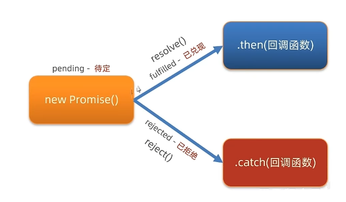

### AJAX
  #### Axios
  - Axios 使用
    1. 引入 axios.js:https://cdn.jsdelivr.net/npm/axios/dist/axios.min.js
    2. 使用 axios 函数
      - 传入再配置
      - 再用 .then 回调函数接受结果，并做后续处理
        ```js
        axiod({
          url:'目标资源地址',
        }).then((res)=>{
          // 对服务器返回的数据进行处理
        })
        ```
  - Axios 查询参数
    - 语法：使用 axios 提供的 params 函数
    - 注意：axios 在运行时把参数名和值，会拼接到 url?参数名 = 值
      ```js
      axiod({
        url:'目标资源地址',
        method:'GET', // 可以省略
        params:{
          参数名:值
        }
      }).then((res)=>{
        // 对服务器返回的数据进行处理
      })
      ``` 
  - Axios 请求配置
    - url:请求的URL网址
    - method:请求的方法，GET可以忽略（不区分大小写）
    - data:提交数据
      ```js
      axiod({
        url:'目标资源地址',
        method:'请求方法',
        data:{
          参数名:值
        }
      }).then((res)=>{
        // 对服务器返回的数据进行处理
      })
      ```
  - Axios 错误处理
    - 语法：使用 axios 提供的 catch 函数
      ```js
      axios({
        // 请求选项
      }).then({
        // 处理数据
      }).catch({
        // 处理错误
      })
      ```
  #### URL
  - URL 组成
    - http协议：超文本传输协议，规定浏览器和服务器之间通信的规则
    - 域名：标记服务器在互联网中的方位
    - 资源路径：标记资源在服务器下的具体位置
  - URL 查询参数
    - 浏览器提供给服务器的额外详细，让服务器返回浏览器想要的数据
    - 格式：?key=value&key=value
    - 示例：https://www.baidu.com/s?wd=%E6%B5%B7%E9%98%94%E6%B5%B7%E6%B9%BE&rsv_spt=1&rsv_iqid=0x8a57599
  - URL 中的端口号
    - 端口号：标记服务器里不同功能的服务程序
    - 端口号范围：0~65535之间的任意整数
    - 默认端口号：80
  #### 常用请求方法
  - GET 获取数据
  - POST 提交数据
  - PUT 修改数据（全部）
  - DELETE 删除数据
  - PATCH 修改数据（局部）
  #### HTTP协议
  - 请求报文：浏览器按照HTTP协议要求的格式，发送给服务器的内容
    1. 请求行：请求方法，URL，协议
    2. 请求头：以键值对的格式携带的附加信息
    3. 空行：分割请求头，空行之后是发送给服务器的资源
    4. 请求体：提交的数据
  - 请求报文-错误排查
  - 响应报文：服务器按照HTTP协议要求的格式，发送给浏览器的数据
    1. 状态行：协议，状态码，状态描述
    2. 响应头：以键值对的格式携带的附加信息
    3. 空行：分割响应头，空行之后是服务器返回的数据
    4. 响应体：返回的资源
  #### HTTP 响应状态码
  - HTTP 响应状态码：用来表示服务器对请求的处理结果
    - 1XX 信息提示
    - 2XX 成功
    - 3XX 重定向
    - 4XX 客户端错误
    - 5XX 服务器错误
  #### 接口文档
  - 接口文档：描述接口的文章
  - 接口：使用AJAX和服务器通讯时，使用的URL，请求方法，以及参数
  #### form-serialize插件
  - 作用：将表单中的数据序列化
  - `serialize(from, { hash: true, empty: true })`
    - hash: 设置获取数据结构
      - true: JS对象
      - false: 查询字符串
    - empty: 设置是否获取空值
      - true: 获取
      - false: 不获取

### XMLHttpRequset
  #### XMLHttpRequset定义
  - 定义：AJAX 即“Asynchronous Javascript And XML”（异步 JavaScript 和 XML），是指一种创建交互式网页应用的网页开发技术。
  - 关系：axios内部采用XMLHttpRequset与服务器交互
  - 使用步骤
    1. 创建XMLHttpRequset对象
    2. 配置请求方法和请求url地址
    3. 监听loadend事件，接收响应结果
    4. 发送请求
    ```js
    const xhr = new XMLHttpRequest()
    xhr.open('请求方法', '请求url网址')
    xgr.addListener('loadend', () => {
      // 响应结果
      console.log(xhr.response)
    })
    xhe.send()
    ```
  #### XMLHttpRequse-查询参数
  - 定义：浏览器提供给服务器的额外信息，让服务器返回浏览器想要的数据
  - 语法：http://xxx.com/xxx/xxx?参数名1=参数值1&参数名2=参数值2
  #### XMLHttpRequse-数据提交
  - 请求头设置Xontent-Type: application/json
  - 请求体携带JSON字符串
  ```js
  const xhr = new XMLHttpRequest()
  xhr.open('请求方法', '请求url网址')
  xgr.addListener('loadend', () => {
    // 响应结果
    console.log(xhr.response)
  })
  // 告诉服务器，我们传递的内容类型，是JSON字符串
  xr.setRequestHeader('Content-Type', 'application/json')
  // 准备数据转换成JSON字符串
  const user  = { name: '张三', age: 18}
  const userStr = JSON.stringify(user)
  // 发送请求
  xhe.send(userStr)
  ```

### Promise
  #### Promise定义
  - Promise对象用于表示一个异步操作的最终完（或失败）及其结果值。
  - 语法
    ```js
    // 1. 创建Promise对象
    const p = new Promise((resolve, reject) => {
    // 2.执行异步任务-并传递结果
    // 成功调用：resolve(result) 触发 then() 执行
    // 失败调用：reject(error) 触发 catch() 执行
    })
    // 3. 接收结果
    p.then(result => {
    // 成功
    }).catch(error => {
    // 失败
    })
    ```
  #### Promise三种状态
  - 作用：理解Promise对象如何关联的处理函数，以及代码执行顺序
  - 概论：一个Promise对象，必然处于以下几种状态之一
    - 待定（pending）：初始状态，既没有被解决也没有被拒绝。
    - 已完成（fulfilled）：意味着操作成功完成。
    - 已拒绝（rejected）：意味着操作失败。
    
  #### Promise链式调用
  - 依靠then()方法返回一个新生成的Promise对象，继续串联下一环任务，直到结束
  - 注意：then()回调函数中的返回值，会影响新生成的Promise对象最终状态和结果
  - 作用：通过链式调用，解决回调函数嵌套问题
  #### Promise.all静态方法
  - 概念：合并多个Promise对象，等待所有同时完成（或某一个失败），做后续逻辑
  /1_AJAX/2_images/Promise.all静态方法.png)
  - 语法：
  ```js
  const p = Promise.all([Promise对象，Promise对象,...])
  p.then(result => {
    // result结果：[Promise对象的结果，Promise对象的结果,...]
  }).catch(error => {
    // 第一个失败的Promise对象，抛出的异常
  })
  ```

### 同步代码和异步代码
  #### 同步代码
  - 我们应该注意的是，实际上浏览器是按照我们书写代码的顺序一行一行地执行程序的。浏览器会等待代码的解析和工作，在上一行完成后才会执行下一行。这样做是很有必要的，因为每一行新的代码都是建立在前面代码的基础之上的。
  - 这也使得它成为一个同步程序。
  #### 异步代码
  - 异步编程技术使你的程序可以在执行一个可能长期运行的任务的同时继续对其他事件做出反应而不必等待任务完成。与此同时，你的程序也将在任务完成后显示结果。
  #### 总结
  - 同步代码：逐行执行，需原地等待结果后，才继续向下执行
  - 异步代码：调用后耗时，不阻塞代码继续执行（不必原地等待），在将来完成后触发一个回调函数。

### 回调函数地狱
  - 回调函数：将一个函数作为参数传递给另一个函数，并在另一个函数内部调用它。
  - 回调函数地狱：回调函数嵌套调用，外部回调函数异步执行的结果是嵌套的回调函数的执行条件。
  - 回调地狱的缺点：
    - 代码臃肿，可读性差
    - 代码复用困难
    - 调试困难
  - 回调地狱的解决：
    - 采用Promise对象
    - 采用async/await语法

### async函数和await
  - 定义:async函数是使用async关键字声明的函数。async函数是AsyncFunction构造函数的实例，并且其中允许使用await关键字。async和await关键字让我们可以用一种更简洁的方式写出基于Promise的异步行为，而无需刻意地链式调用promise。
  - 错误捕获
    - try...catch
    ```js
    try{
      // 要执行的代码
      // 如果try里某行代码报错后，try中剩余的代码不会执行了
    } catch (error) {
      // error接收的是，错误信息
      // try里代码，如果有错误，直接进入这里执行
    }
    ```

### 事件循环
  - 概念：JavaScript有一个基于事件循环的并发模型，事件循环负责执行代码、收集和处理事件以及执行队列中的子任务。这个模型与其它语言中的模型截然不同，比如C和Java。
  - 原因：JavaScript单线程（某一刻只能执行一行代码），为了让耗时代码不阻塞其他代码运行，设计了事件循环模型。
  - 定义：执行代码和收集异步任务的模型，在调用栈空闲，反复调用任务队列里回调函数的执行机制，就叫事件循环

### 宏任务和微任务
  - ES6之后引入了Promise对象，Promise对象实现了异步操作的链式调用。
  - 异步任务分为：
    - 宏任务：由浏览器环境执行的异步代码
    - 微任务：由JS引擎环境执行的异步代码
    /1_AJAX/2_images/宏任务和微任务.png)

## 实际案例
  ### 图书管理
  #### Bootrstrap弹框
  - 不离开当前页面，显示单独内容，供用户操作
  - 属性控制方式
    1. 引入bootstrap.css和bootstrap.js
    2. 准备弹框结构，确认结构
    3. 通过自定义属性，控制弹框的显示和隐藏
      ```html
      <button type="button" class="btn btn-primary" data-bs-toggle="modal" data-bs-target="css选择器"> 
      <!-- css选择器:结构的类名或者id名 -->
      ```
    4. 通过JS控制，弹框的显示和隐藏
      ```js
      // 创建弹框对象
      const modalDom = document.querySelector('css选择器')
      const modal = new bootstrap.Modal(modalDom)
      // 显示弹框
      modal.show()
      // 隐藏弹框
      modal.hide()
      ```
  #### 渲染列表
  - 封装渲染函数，方便后面使用
  - 使用axios获取到数据后在then方法中，使用map方法遍历数组，使用join方法将数组转换为字符串，方便写入页面中
  #### 添加图书
  - 新增图书-表单
  - 收集数据&提交保存
    - 收集表单数据，并提交到服务器保存
    ```js
    // 获取表单元素对象
    const addForm = document.querySelector('表单')
    // 获取表单元素内容
    const bookObj = serialize(addForm, { hash: true, empty: true })
    ```
  - 刷新-图书列表
    - 一般在axios请求完成后的then方法中执行封装的刷新函数
  #### 删除图书
  - 绑定点击事件（获取图书id）
  - 调用删除接口
  - 刷新-图书列表
  #### 修改图书
  - 编辑图书-表单
  - 表单（数据回显）
  - 修改保存&刷新列表

  ### 黑马头条-后台管理
  #### 验证码登录
  - 目标：完成验证码登录，后端设置验证码默认为246810
  - 原因：因为短信接口不是免费的，防止恶意盗刷
  - 步骤：
    1. 在utils/requset.js配置axios请求基地址
    2. 收集手机号和验证码数据
    3. 基于axios调用验证码登录接口
  #### 验证码登录-完整流程
  /1_AJAX/2_images/验证码登录流程.png)
  #### token 介绍
  - 概念：访问权限的令牌，本质是一串字符串
  - 创建：正确登录后，由后端签发并且返回
  - 作用：判断是否有登陆状态等，控制访问权限
  - 注意：前端只能判断token's存在与否，不能判断是否有效
  #### token 使用
  - 目标：只有登录状态，才可以访问内容页面
  - 步骤：
    1. 在 utils/auth.js 中判断无 token 令牌字符串，则强制跳转到登录页（手动修改地址栏测试）
    2. 在登录成功后，保存 token 令牌字符串到本地，再跳转到首页（手动修改地址栏测试）
    ```js
    const token = localStorage.getItem('token')
    // 没有token令牌字符串，则强制跳转登录页
    if (!token) {
      location.href = '.login/index.html'
    }
    ```
  #### 个人信息设置和axios请求拦截器
  - 需求：设置用户昵称
  - 语法：axios 可以在 headers 选项传递请求头参数
  ```js
  axios({
    url:'目标资源地址',
    headers: {
      Authorization: `Bearer ${localStorage.getItem('token')}`
    }
  })
  ```
  - 问题：很多接口，都需要携带 token 令牌字符串
  - 解决：在请求拦截器统一设置公共 headers 选项
  - axios 请求拦截器:发起请求之前，触发的配置函数，对请求参数进行额外配置
  /1_AJAX/2_images/axios请求拦截器.png)
  #### axios 响应拦截器和身份验证失败
  - axios 响应拦截器：响应回到 then/catch 之前，触发的拦截函数，对响应结果统一处理
  /1_AJAX/2_images/axios响应拦截器.png)
  #### 优化-axios响应结果
  - 目标：axios 直接接收服务器返回的响应结果
  #### 发布文章-富文本编辑器（wangEditor插件）
  - 富文本：带样式、多格式的文本，在前端一般使用标签配合内联样式实现
  - 富文本编辑器：用于编写富文本内容的容器
  #### 发布文章-频道列表
  - 目标：展示频道列表，供用户选择
  - 步骤：
    1. 获取频道列表数据
    2. 展示到下拉菜单中
  #### 发布文章-封面设置
  - 目标：文章封面的设置
  - 步骤：
    1. 准备标签结构和样式
    2. 选择文件并保存在 FormData
    3. 单独上传图片并得到图片 URL 地址
    4. 回显并切换 img 标签展示（隐藏 + 号上传标签）
    - 注意：图片地址临时存储在 img 标签上，并未和文章关联保存
  #### 发布文章-收集并保存
  - 目标：收集文章内容，并提交保存
  - 步骤：
    1. 基于 form-serialize 插件收集表单数据对象
    2. 基于 axios 提交到服务器保存
    3. 调用 Alert 警告框反馈结果给用户
    4. 重置表单并跳转到列表页
  #### 内容管理-筛选功能
  - 目标：根据筛选条件，获取匹配数据展示
  - 步骤：
    1. 设置频道列表数据
    2. 监听筛选条件改变，保存查询信息到查询参数对象
    3. 点击筛选时，传递查询参数对象到服务器
    4. 获取匹配数据，覆盖到页面展示  
  #### 内容管理-分页功能
  - 目标：完成文章列表，分页管理功能
  - 步骤：
    1. 保存并设置文章总条数
    2. 点击下一页，做临界值判断，并切换页码参数请求最新数据
    3. 点击上一页，做临界值判断，并切换页码参数请求最新数据
  #### 内容管理-删除功能
  - 目标：完成删除文章功能
  - 步骤：
    1. 关联文章 id 到删除图标
    2. 点击删除时，获取文章 id
    3. 调用删除接口，传递文章 id 到服务器
    4. 重新获取文章列表，并覆盖展示
  #### 内容管理-删除最后一条
  - 目标：在删除最后一页，最后一条时有 Bug
  - 解决：
    1. 删除成功时，判断 DOM 元素只剩一条，让当前页码 page--
    2. 注意，当前页码为 1 时不能继续向前翻页
    3. 重新设置页码数，获取最新列表展示
  #### 内容管理-编辑文章-回显
  - 目标：编辑文章时，回显数据到表单
  - 步骤：
    1. 页面跳转传参（URL 查询参数方式）
    2. 发布文章页面接收参数判断（共用同一套表单）
    3. 修改标题和按钮文字
    4. 获取文章详情数据并回显表单
  #### 内容管理-编辑文章-保存
  - 目标：确认修改，保存文章到服务器
  - 步骤：
    1. 判断按钮文字，区分业务（因为共用一套表单）
    2. 调用编辑文章接口，保存信息到服务器
    3. 基于 Alert 反馈结果消息给用户
  #### 退出登录
  - 目标：完成退出登录效果
  - 步骤：
    1. 绑定点击事件
    2. 清空本地缓存，跳转到登录页面


