### 选择器优先级
 - 通配符 < 标签 < 类 < id < 行内 < !important
 
 
### 复合选择器
 - 后代选择器
   -  `父选择器 子选择器 { CSS属性 }`
   - 父子选择器之间用空格隔开
   - 会选中所有后代标签
 - 子代选择器
   - `父选择器 > 子选择器 { CSS属性 }`
 - 并集选择器
   - `选择器1,选择器2,选择器3...`
 - 交集选择器
   - `选择器1选择器2 {CSS属性}`
   - 选择器连写，不用隔开
   - 选中同时满足多个条件的元素
 - 伪类选择器
   - `选择器:hover {CSS属性}`
 - 伪类选择器（超链接状态）
   1. `:link`     访问前
   2. `:visited`  访问后
   3. `:hover`    鼠标悬停
   4. `:active`   点击时
 - 结构伪类选择器
   - `E:first-child`  查找第一个E元素
   - `E:last-child`   查找最后一个E元素
   - `E:nth-child(N)` 查找第N个E元素（第一个元素N值为1）
   - `E:nth-child(公式)` 
   
 - 伪元素选择器
   - `E::before` 在E元素里面最`前面`添加一个伪元素 
   - `E::after`  在E元素里面最`后面`添加一个伪元素
   

### 背景属性
 - 背景色 `background-color`
 - 背景图 `background-image`
 - 背景图平铺方式 `background-repeat`
   - `no-repeat` 不平铺
   - `repeat`    平铺
   - `repeat-x`  水平方向平铺
   - `repeat-y`  垂直方向平铺
 - 背景图位置 `background-position`
   - `left`   左侧
   - `right ` 右侧
   - `center` 居中
   - `top`    顶部
   - `bottom` 底部
 - 背景图缩放 `background-size`
   - `cover`   完全缩放
   - `contain` 根据背景区域缩放
   - 百分比、数字+单位
 - 背景图固定 `background-attachment`
   - `fixed`  固定定位
 - 背景复合属性 `background`
   - 背景色 背景图 背景图平铺方式 背景图位置/背景图缩放

### 标签显示模式
 - 块级元素
   - 独占一行
   - 宽度默认是父级的100%
   - 添加宽高元素生效
 - 行内元素
   - 一行多个
   - 尺寸由内容撑开
   - 添加宽高元素不生效
 - 行内块元素
   - 一行多个
   - 尺寸由内容撑开
   - 添加宽高元素生效

### 转换显示模式 `display`
 - `block`        块级
 - `inline-block` 行内块
 - `inline`       行内

### 盒子模型

 - 盒子模型被border和padding撑大解决方法
   1. 手动计算，减去border/padding的尺寸
   2. 内减模式:`box-sizing:border-box`
 - margin不会撑大盒子
   - 左右居中:`margin: 上下 auto`
 - 清除标签默认样式
    ```css
     *{
       margin: 0;
       padding: 0;
       /* 盒子内减模式，避免被border和padding撑大 */
       box-sizing: border-box;
       /* 去掉列表的项目符号 */
      list-style: none;
       /* 去掉a标签的下划线 */
       text-decoration: none;
     }
   ```
 - 元素溢出 `overflow`
   - hidden 溢出隐藏
   - scroll 溢出滚动（无论是否溢出，都显示滚动调）
   - auto 溢出滚动（溢出才显示滚动调）
 - 塌陷问题
   - 父子级标签，子级添加上外边距，会产生塌陷；导致父子级一起向下移动
   - 解决方法
     1. 取消父级`margin`，父级设置`padding`
     2. 父级设置`overflow:hidden`
     3. 父级设置`border-top`
 - 圆角边框`border-radius`
   - 圆形：`border-radius:50%/高和宽的一半`
   - 胶囊：`border-radius:高的一般`
 - 盒子阴影`box-shadow`
   - X Y 模糊半径 扩散半径 颜色 内外阴影(内inset/默认外)

### 浮动 `float`
 - `left`  左对齐
 - `right` 右对齐

#### 清除浮动
   1. 额外标签法：在父元素内容的最后添加一个块级元素 `div#clearfix`，设置CSS属性`clear: both`
   2. 单伪元素法：
      ```css
       .clearfix::after {
        /* 伪元素必须要有content属性 */
        content:"";
        display:block;
        clear:both;
       }
      ```
   3. 双伪元素法
      ```css
       /* before 解决外边距塌陷 */
       .clearfix::before,
       .clearfix::after {
        /* 伪元素必须要有content属性 */
       content:"";
       display:table;
       }
       /* after 清除浮动 */
       .clearfix::after {
         clear:both;
       }
      ```
   4. 父级元素添加CSS属性 `overflow:hidden`

### Flex布局 `display:flex;`
 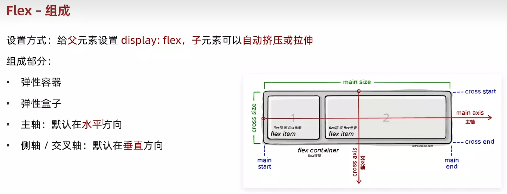
 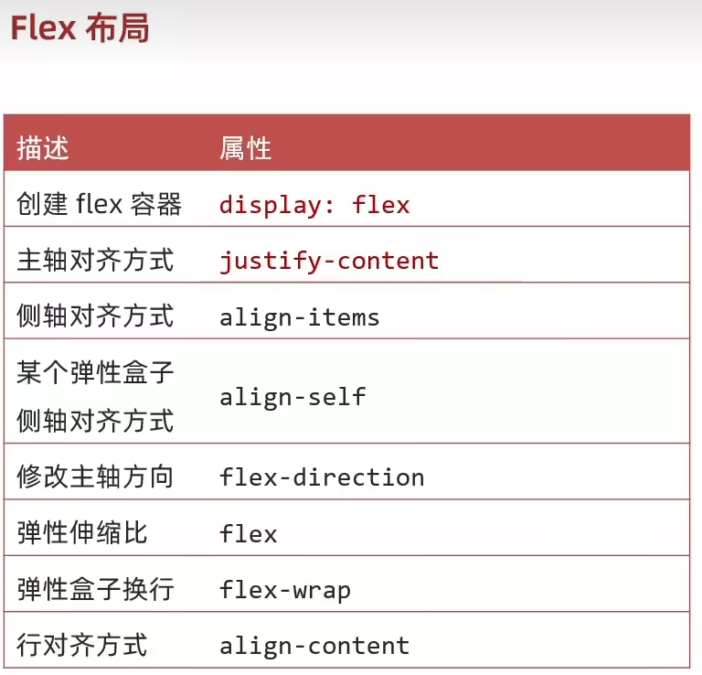
 - 创建Flex容器 `display:flex`
 - 主轴对齐方式 `justify-content`
   
 - 侧轴对齐方式 `align-items`
 - 某个弹性盒子侧轴对齐方式 `align-self`
   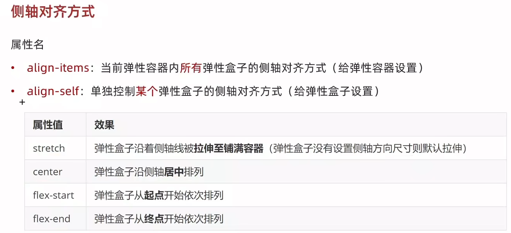
 - 修改主轴方向 `flex-direction`
   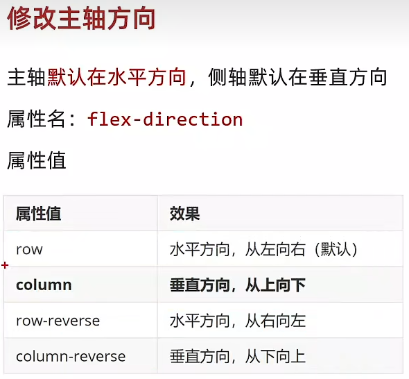
 - 弹性伸缩比 `flex`
   
 - 弹性盒子换行 `flex-wrap`
   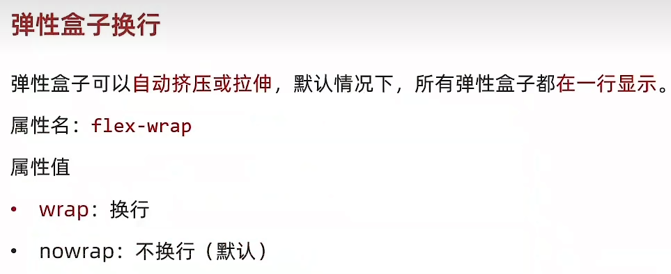
 - 行对齐方式 `align-content`
   

### 定位 `position`
 - 子级绝对定位，父级相对定位（子绝父相）
 - `relative` 相对定位
   1. 参照物：自己原来的位置
   2. 不脱标，占位
   3. 标签的显示模式特点不变化
 - `absolute` 绝对定位
   1. 参照物：先找最近的已经定位的祖先元素；如果没有，则以浏览器可视区域改变位置
   2. 脱标，不占位
   3. 显示模式改变：宽高生效（具备行内块的特点）
 - `fixed` 固定定位
   1. 参照物：浏览器窗口
   2. 脱标，不占位
   3. 显示模式改变：宽高生效（具备行内块的特点）
 - `z-index` 堆叠层级
   - 取值是整数，数字越大，越靠上
 - 定位居中
   1. 绝对定位 `position:absolute;`
   2. 水平、垂直边偏移量为50% `left:50%;top:50%;`
   3. 子级向左、上移动自己尺寸的一半 `transform:translate(-50%,-50%);`

  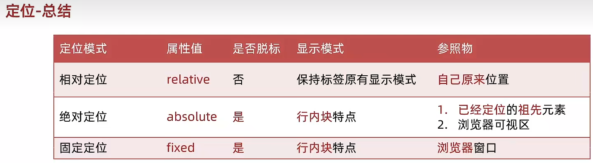

### 字体图标
 - iconfont 图标库: <https://www.iconfont.cn/>
   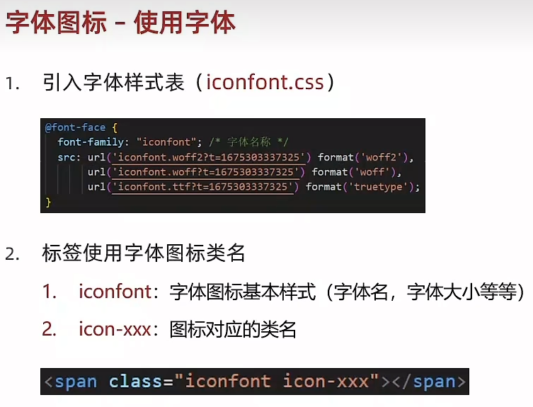
 - 上传矢量图

### 垂直对齐方式 `vertical-align`
 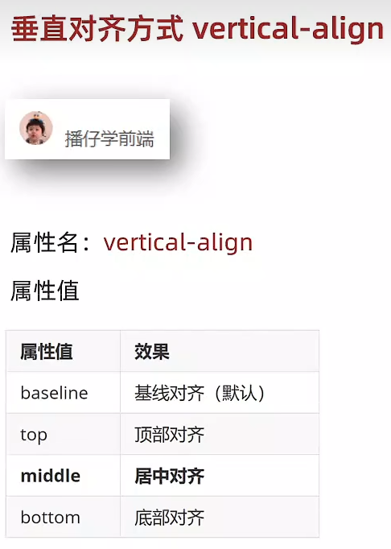
 - `baseline` 基线对齐
 - `top` 顶部对齐
 - `middle` 居中对齐
 - `bottom` 底部对齐

#### 图片底下空白去除方法
 - 因为浏览器把行内块、行内标签当做文字处理，默认按基线对齐
 - 效果:图片img的底下有空白，转块级不按基线对齐，空白就消失了
   1. `display: block;`
   2. 用`vertical-align`

### 透明度 `opacity`
 - 属性值：0-1 ; 设置整个元素的透明度（包含背景和内容）
 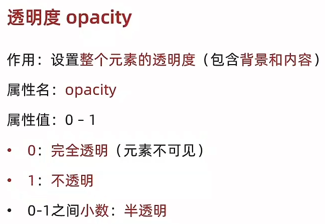

### 光标类型 `cursor`
 - `default` 默认，通常是箭头
 - `pointer` 小手效果，提示用户可以点击
 - `text` 工字型，提示用户可以选择文字
 - `move` 十字光标，提示用户可以移动
 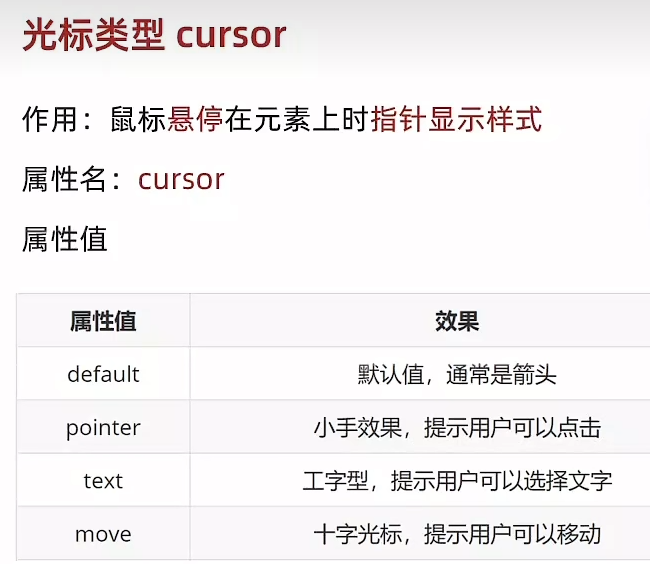

 ### Favicon 图标
  

### 过渡 `transition`
 - 属性值：过渡的属性 花费时间（s）
 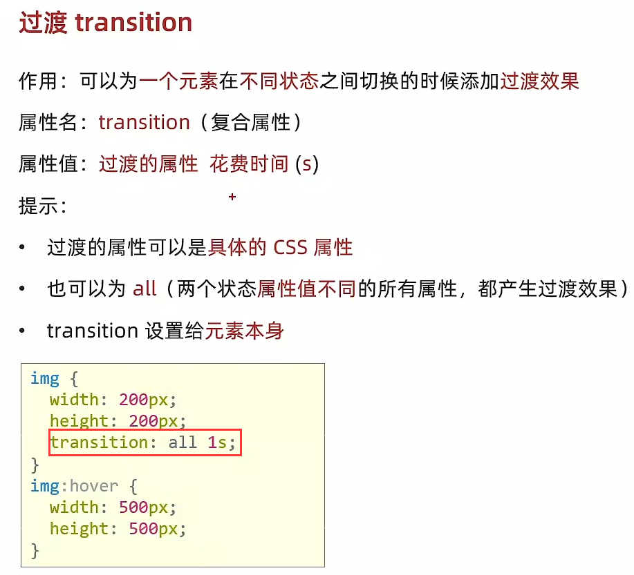

### 平面转换 `transform`
 - 平移 `transform: translate(X轴移动距离,Y轴移动距离)`
 - 旋转 `transform: rotate(旋转角度deg)`
 - 倾斜 `transform: skew(角度度数deg)`
 - 改变转换原点 `transform-origin: 水平原点位置 垂直原点位置`
   - 属性值：left,right,top,bottom,center/像素单位数值/百分比
 - 多重转换（先平移后旋转）`transform: translate(X轴移动距离,Y轴移动距离) rotate(旋转角度deg)`
 - 缩放 `transform: scale(缩放倍数)`/`transform: scale(X轴缩放倍数，Y轴缩放倍数)`
 - 平移实现居中效果
   - 方法1
     ```css
     position:absolute;
     left:50%;
     top:50%;
     /* margin */
     margin-left:宽的一半;
     margin-top:高的一半;
     ```
   - 方法2
     ```css
     position:absolute;
     left:50%;
     top:50%;
     transform:translate(-50%,-50%);
     ```

### 渐变 `background-image: linear-gradient` `background-image: radial-gradient`
- 线性渐变 `background-image: linear-gradient(to 渐变方向,颜色1 终点位置,颜色2 终点位置,...)`
  - 颜色（必写）
  - 渐变方向：to 方位名词/角度度数
  - 终点位置：百分比
- 径向渐变 `background-image: radial-gradient(半径 at 圆心位置,颜色1 终点位置,颜色2 终点位置,...)`
  - 半径可以是2条，则为椭圆
  - 圆心位置：像素单位数值/百分比/方位名词

### 空间转换 `transform`
- 平移
  - `transform: translate3d(x, y, z)`
  - `transform: translateX()`
  - `transform: translateY()`
  - `transform: translateZ()`
- 视距 `perspective`
  - `perspective: 视距`
  - 添加给父级，取值范围800-1200
- 旋转
  - `transform: rotateZ(值)`
  - `transform: rotateX(值)`
  - `transform: rotateY(值)`
  - `transform: rotate3D(x, y, z, 角度度数)`
- 立体呈现 `transform-style`
  - `transform-style: flat` 子级处于平面中
  - `transform-style: preserve-3d` 子级处于3D空间
  - 实现步骤
    1. 父元素添加transform-style: preserve-3d;
    2. 子级定位
    3. 调整子盒子的位置（位移或旋转）
- 空间缩放 
  - `transform: scale3D()`
  - `transform: scaleX()`
  - `transform: scaleY()`
  - `transform: scaleZ()`

### 动画 `animation`
-  `animation: 动画名称 动画时长 速度曲线 延迟时间 重复次数 动画方向 执行完毕时状态`
  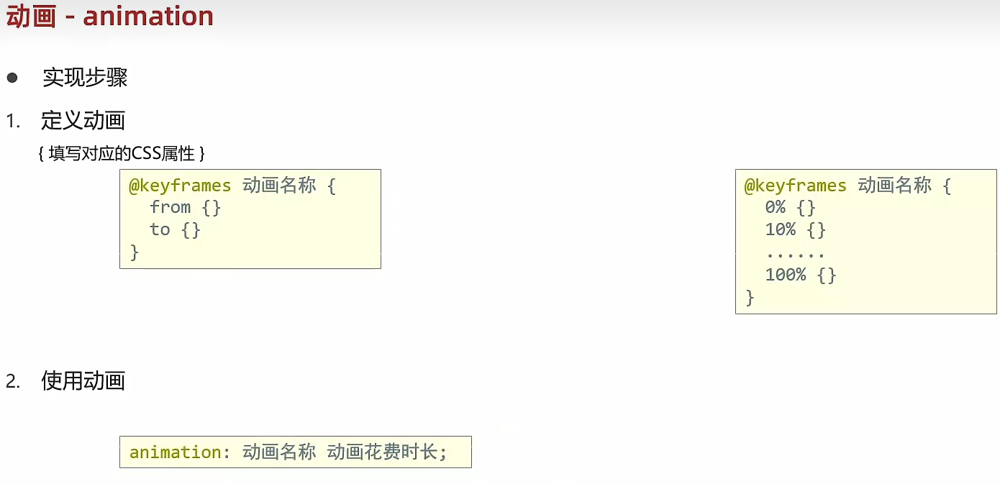
  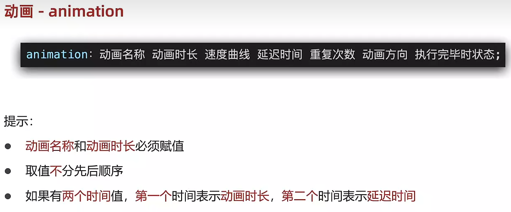
- 速度曲线
  1. `linear` 匀速动画
  2. `steps()` 逐帧动画
- 重复次数
  1. 使用数字
  2. `infinite` 无限次重复
- 播放方向
  1. `normal` 默认值，正常播放
  2. `reverse` 倒序播放
  3. `alternate` 正常和倒序交替播放
- 执行完毕时状态
  1. `none` 默认，动画结束后恢复到初始状态
  2. `forwards` 动画结束后保持最后一帧的状态
  3. `backwards` 动画开始前应用第一帧的状态
- 播放状态
  1. `running` 默认，动画正在播放
  2. `paused` 动画暂停播放
  3. `alternate` 正常和倒序交替播放
  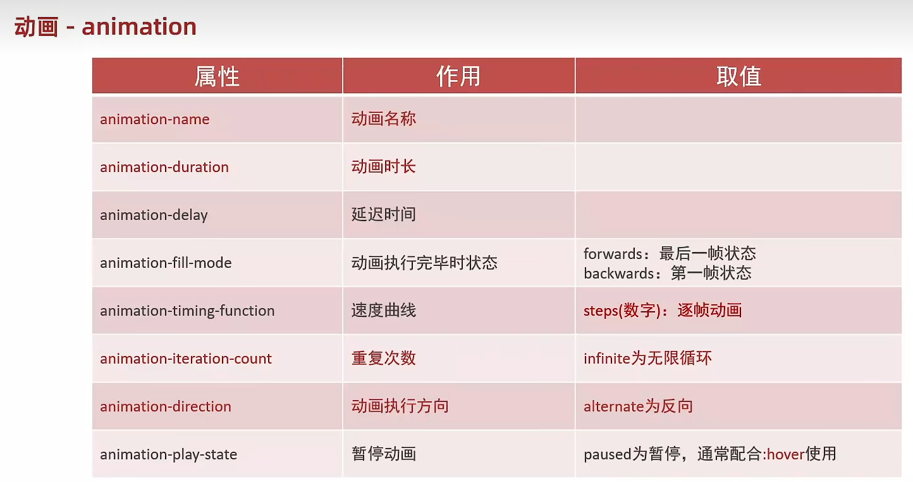

#### 逐帧动画 `steps`
  - 步骤
    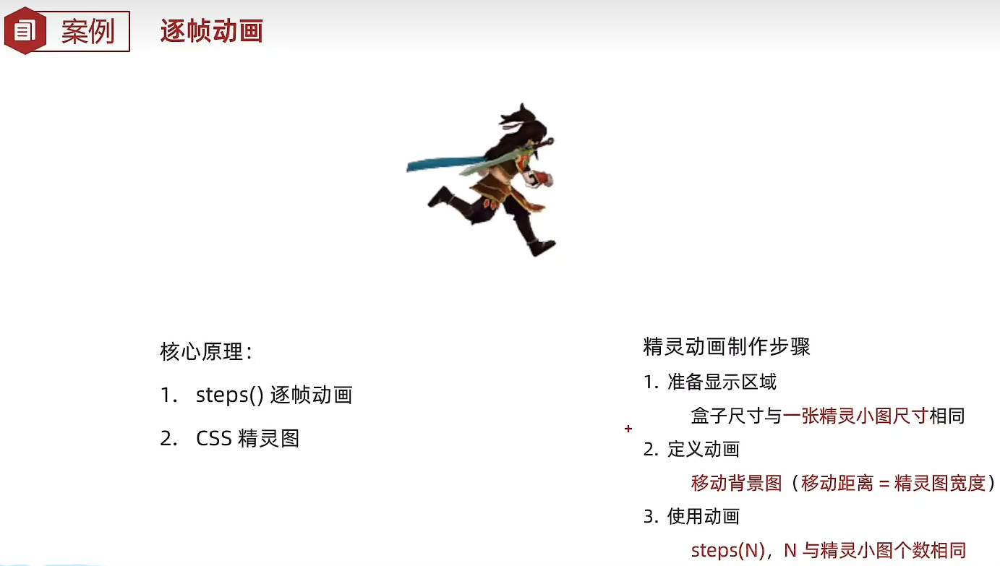
  - 实例
    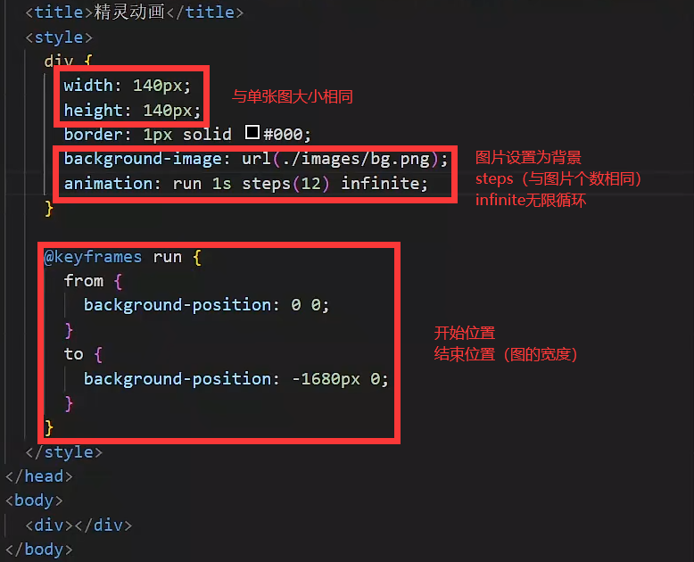
#### 多组动画
  - 多组动画
    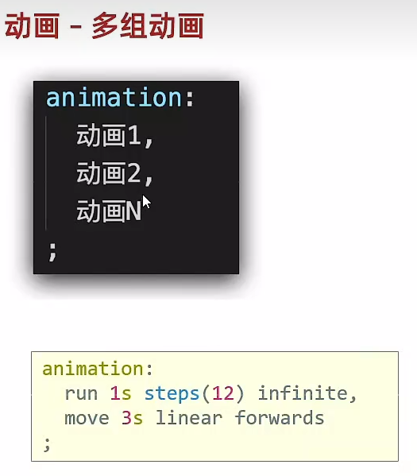

### 移动端适配 `rem` `vw`
#### rem
  - rem介绍
    - rem单位，是相对单位
    - rem单位是相当于HTML标签字号计算结果
    - 1rem = 1HTML字号大小
  - 使用步骤
    1. 给HTML标签加字号 `font-size: xxpx;`
    2. 使用rem单位书写尺寸
#### 媒体查询
  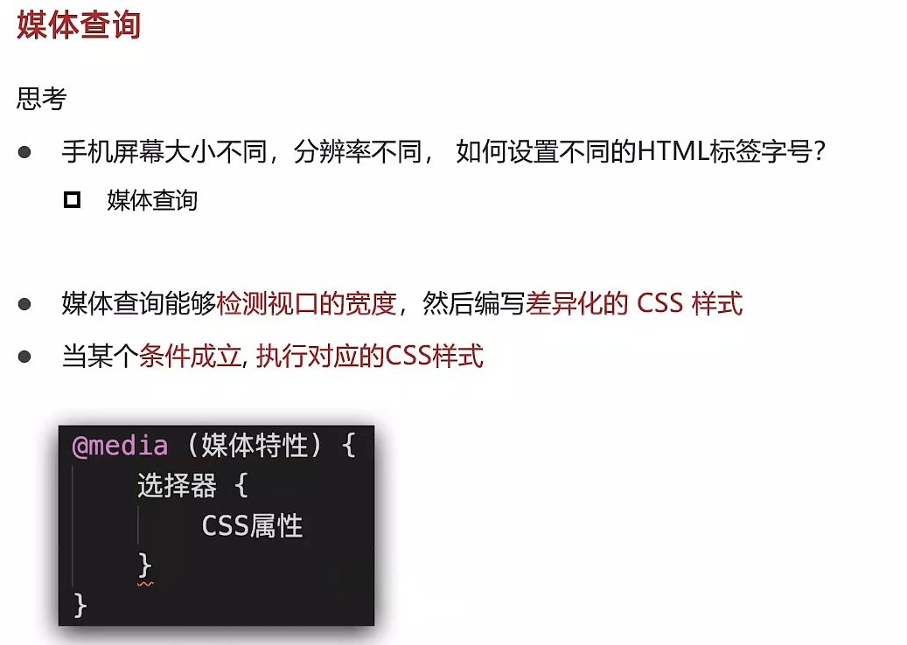
#### rem适配
  - 步骤
    1. 使用媒体查询，给不同的视口的屏幕设置不同的HTML字号
    2. 使用rem单位书写尺寸

    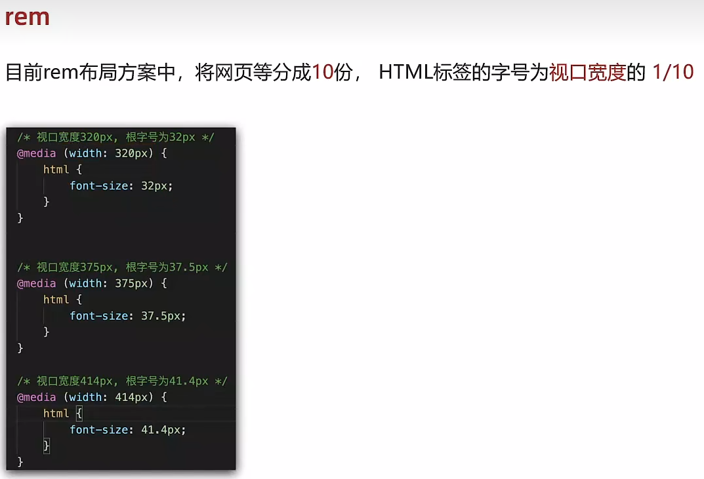
#### rem-flexible.js
  - flexible.js是手淘开发出的一个用来适配移动端的js库。
  - 核心原理就是根据不同的视口宽度给网页中html根节点设置不同的font-size。
#### less
  - 运算
    1. 加减乘除直接写表达式
    2. 除法要添加 小括号 / . `(100 / 4px)` `100 ./ 4px`
  - 变量
    1. 定义变量： `@变量名:数据;`
    2. 使用变量： `CSS属性:@变量名;`
    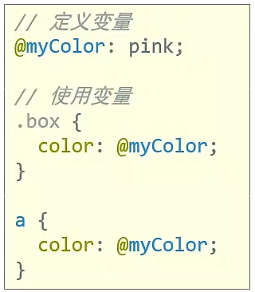
  - 导入（在less中导入less）
    - 作用：导入less公共样式文件
    - 语法：导入: `@import "文件路径";`
    - 提示：如果是less文件可以省略后缀
  - 导出
    - 写法：在less文件第一行文件添加 `// out: 存储URL`
    - 提示：文件夹名称后面要添加 / 
  - 禁止导出
    - 写法：在less文件第一行添加： `// out: false`

#### vw vh
  - 相对视口的尺寸计算的结果
  - vw：viewport width 1vw = 1/100视口宽度
  - vh：viewport height 1vh = 1/100视口高度

### 响应式网页
#### 媒体查询
  - @media 关键词 媒体类型 and (媒体特性) { CSS代码 }
    1. 关键词 and/only/not
    2. 媒体类型
      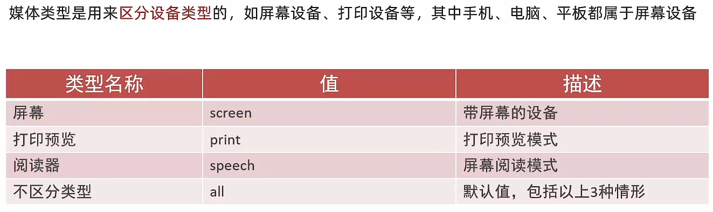
    3. 媒体特性
      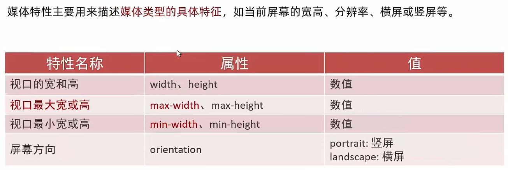
  - 简略写法
    - 媒体特性
      1. max-width >=最大宽度
      2. min-width <=最小宽度
    ```css
    @media (媒体特性) {
      选择器{
        样式
      }
    }
    ```
    
  - 外部CSS写法
    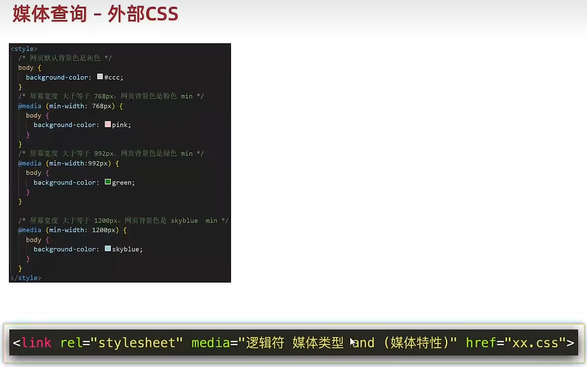
#### Bootstrap
  - 引入
  - 调用类名 例 响应式版心： container
    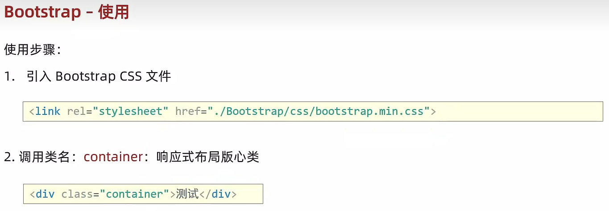
  ##### 栅格系统
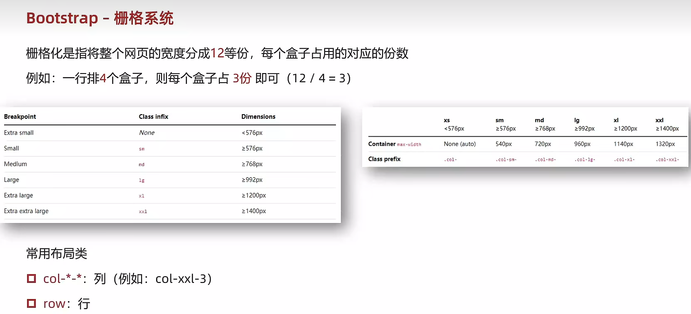
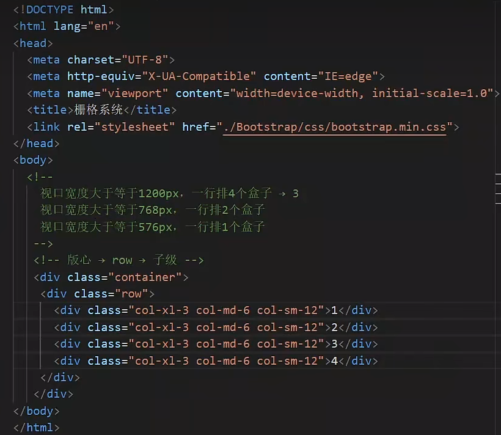
