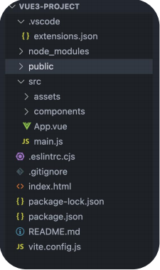

### 使用create-vue创建项目
1. 前提环境条件：已安装 16.0 或更高版本的 Node.js
   - `node -v`
2. 创建一个Vue应用
   - `npm init vue@latest`

### 项目目录和关键文件
- 关键文件：
  1. vite.config.js - 项目的配置文件 基于vite的配置
  2. package.json - 项目包文件 核心依赖项变成了 Vue3.x 和 vite
  3. main.js - 入口文件 createApp函数创建应用实例
  4. app.vue - 根组件 SFC单文件组件 script - template - style
     - 变化一：脚本script和模板template顺序调整
     - 变化二：模板template不再要求唯一根元素
     - 变化三：脚本script添加setup标识支持组合式API
  5. index.html - 单页入口 提供id为app的挂载点

