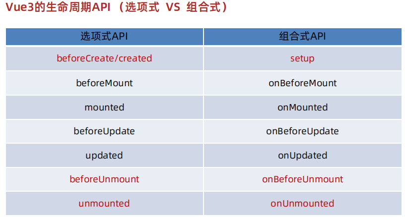
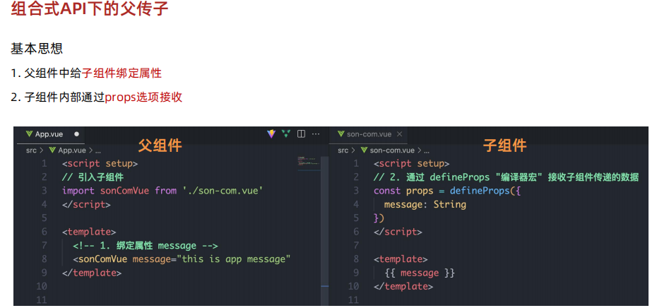
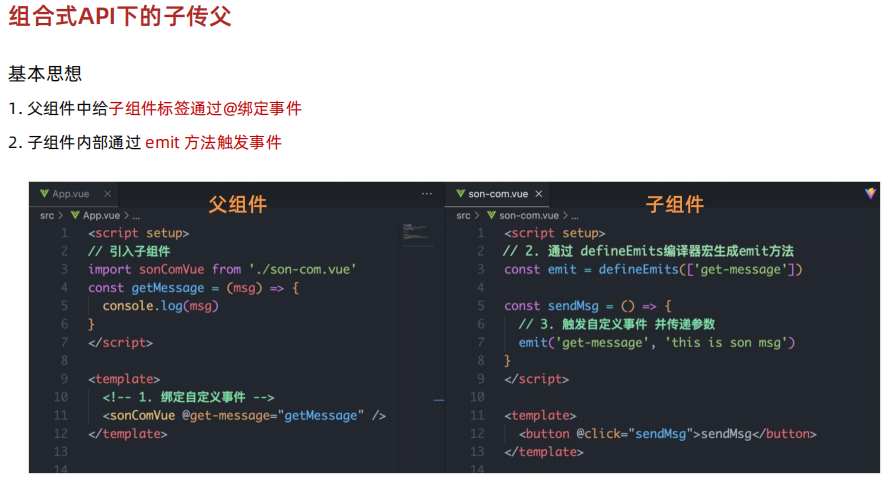
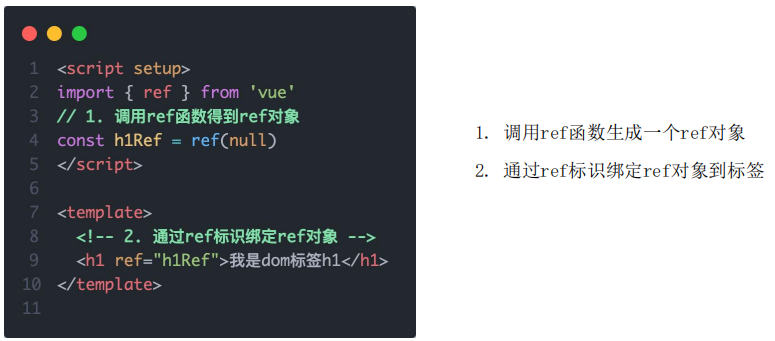
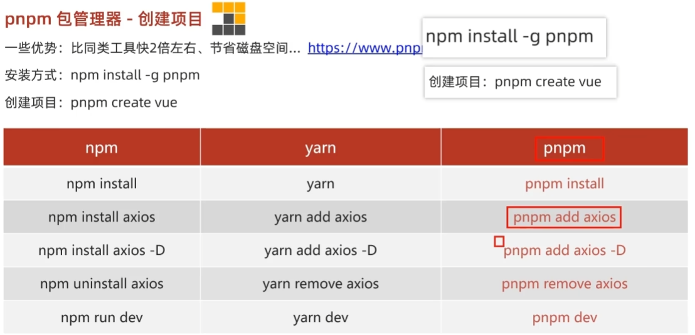

### 使用create-vue创建项目
1. 前提环境条件：已安装 16.0 或更高版本的 Node.js
   - `node -v`
2. 创建一个Vue应用
   - `npm init vue@latest`

### 项目目录和关键文件
- 关键文件：
  1. vite.config.js - 项目的配置文件 基于vite的配置
  2. package.json - 项目包文件 核心依赖项变成了 Vue3.x 和 vite
  3. main.js - 入口文件 createApp函数创建应用实例
  4. app.vue - 根组件 SFC单文件组件 script - template - style
     - 变化一：脚本script和模板template顺序调整
     - 变化二：模板template不再要求唯一根元素
     - 变化三：脚本script添加setup标识支持组合式API
  5. index.html - 单页入口 提供id为app的挂载点


### 组合式API
#### setup选项
1. setup选项的执行时机？
   - beforeCreate钩子之前 自动执行
2. setup写代码的特点是什么？
   - 定义数据 + 函数 然后以对象方式return
3. `<script setup>`解决了什么问题？
   - 经过语法糖的封装更简单的使用组合式API
4. setup中的this还指向组件实例吗？
   - 指向undefined

#### reactive和ref函数
- `reactive()`
  - 作用：接受对象类型数据的参数传入并返回一个响应式的对象
  - 核心步骤：
     1. 从 vue 包中导入 `reactive` 函数
     2. 在 `<script setup>` 中执行 `reactive` 函数并传入类型为对象的初始值，并使用变量接收返回值
        ```js
        <script setup>
        // 导入
        import { reactive } from 'vue'
        // 执行函数 传入参数 变量接收
        const state = reactive(对象类型数据)
        <script>
        ```
- `ref()`
  - 作用：接收简单类型或者对象类型的数据传入并返回一个响应式的对象
  - 核心步骤：
     1. 从 vue 包中导入 `ref` 函数
     2. 在 `<script setup>` 中执行 `ref` 函数并传入类型为简单类型或者对象类型的参数，并使用变量接收返回值
        ```js
        <script setup>
        // 导入
        import { ref } from 'vue'
        // 执行函数 传入参数 变量接收
        const state = ref(简单数据类型或者复杂数据类型)
        <script>
        ```
- 总结：
   1. reactive和ref函数的共同作用是什么 ？
      - 用函数调用的方式生成响应式数据
   2. reactive vs ref ？
      1. reactive不能处理简单类型的数据
      2. ref参数类型支持更好但是必须通过.value访问修改
      3. ref函数的内部实现依赖于reactive函数
   3. 在实际工作中推荐使用哪个？
      - 推荐使用ref函数，更加灵活统一

#### computed计算属性函数
- 计算属性基本思想和Vue2的完全一致，组合式API下的计算属性只是修改了写法
- 核心步骤：
  1. 导入computed函数
  2. 执行函数 在回调参数中return基于响应式数据做计算的值，用变量接收
      ```js
      <script setup>
      // 导入
      import { computed } from 'vue'
      // 执行函数 在回调参数中return基于响应式数据做计算的值，用变量接收
      const state = computed(() => {
         return 响应式数据.value + 10
      })
      <script>
      ```

#### watch监视属性函数
- 作用: 侦听一个或者多个数据的变化，数据变化时执行回调函数
- 俩个额外参数：
  1. `immediate`（立即执行） 
  2. `deep`（深度侦听）
- 监视属性基本思想和Vue2的完全一致，组合式API下的监视属性只是修改了写法
- 核心步骤：
  1. 导入watch函数
  2. 执行watch函数传入要侦听的响应式数据(ref对象)和回调函数
- 基础使用 - 侦听单个数据
   ```js
   <script setup>
   // 1. 导入watch
   import { ref,watch } from 'vue'
   const count = ref(10)
   // 2. 调用 watch 监听变化
   watch(count,(newValue,oldValue) => {
      
   })
   ```
- 基础使用 - 侦听多个数据
   ```js
   <script setup>
   // 1. 导入watch
   import { ref,watch } from 'vue'
   const count = ref(10)
   const name = ref('张三')
   // 2. 调用 watch 监听变化
   watch([count,name],(newValue,oldValue) => {
      
   })
   ```

#### 生命周期函数

- 生命周期函数基本使用
  1. 导入生命周期函数
  2. 执行生命周期函数 传入回调
      ```js
      import { onMounted } from 'vue'
      onMounted(() => {
        // 自定义逻辑 
      })
      ```

#### 父子通信
- 组合式API下的父传子
  - 基本思想
    1. 父组件中给子组件绑定属性
    2. 子组件内部通过props选项接收
    
- 组合式API下的子传父
  - 基本思想
    1. 父组件中给子组件标签通过@绑定事件
    2. 子组件内部通过 emit 方法触发事件
    

#### 模板引用
- 概念：通过ref标识获取真实的dom对象或者组件实例对象
- 如何使用（以获取dom为例 组件同理）
  1. 调用ref函数生成一个ref对象
  2. 通过ref标识绑定ref对象到标签
  

#### provide和inject
- 作用：顶层组件向任意的底层组件传递数据和方法，实现跨层组件通信
- 跨层传递普通数据
  1. 顶层组件通过provide函数提供数据
  2. 底层组件通过inject函数获取数据
      ```js
      // 顶层组件
      provide('key', 顶层组件中的数据)
      // 底层组件
      const message = inject('key')
      ```
- 跨层传递响应式数据
   - 在调用provide函数时，第二个参数设置为ref对象
      ```js
      // 顶层组件
      provide('key', ref对象)
      // 底层组件
      const message = inject('key')
      ```
- 跨层传递方法
   - 顶层组件可以向底层组件传递方法，底层组件调用方法修改顶层组件中的数据
      ```js
      // 顶层组件
      const setCount = () => {
        count.value++
      }
      provide('key', setCount)
      // 底层组件
      const setCount = inject('key')
      ```

### 编译器宏
- 概念：编译器内置的函数，可以用于编译模板
#### defineProps
- 作用：用于声明props
- 语法：
   ```js
   import { defineProps } from 'vue'
   const props = defineProps({
      name: String,
      age: Number
   })
  ```
#### defineEmits
- 作用：用于声明emit事件
- 语法：
   ```js
   import { defineEmits } from 'vue'
   const emit = defineEmits(['change'])
   ```
#### defineExpose
- 作用：用于声明需要暴露给父组件的数据和方法
- 语法：
   ```js
   import { ref, defineExpose } from 'vue'
   const count = ref(0)

   const expose = defineExpose({
      count
   })
   ```
#### defineOptions
- 作用：用于声明组件选项
- 语法：
   ```js
   import { defineOptions } from 'vue'

   defineOptions({
      name: 'MyComponent'
   })
   ```
#### defineModel
- 作用：用于声明组件的model
- 语法：
   ```js
   import { defineModel } from 'vue'

   defineModel({
      prop: 'modelValue',
      event: 'update:modelValue'
   })
   ```

### Pinia
#### getters实现
- Pinia中的 getters 直接使用 computed函数 进行模拟, 组件中需要使用需要把 getters return出去

#### action异步实现

#### storeToRefs工具函数
- 使用storeToRefs函数可以辅助保持数据（state + getter）的响应式解构

#### Pinia持久化插件
- 官方文档：https://prazdevs.github.io/pinia-plugin-persistedstate/zh/
  1. 安装插件`pinia-plugin-persistedstate`
  `npm i pinia-plugin-persistedstate`
  1. main.js 使用
     ```js
     import persist from 'pinia-plugin-persistedstate'
     ...
     app.use(createPinia().use(persist))
     ```
  2. store仓库中，`persist: true` 开启

### pnpm|
