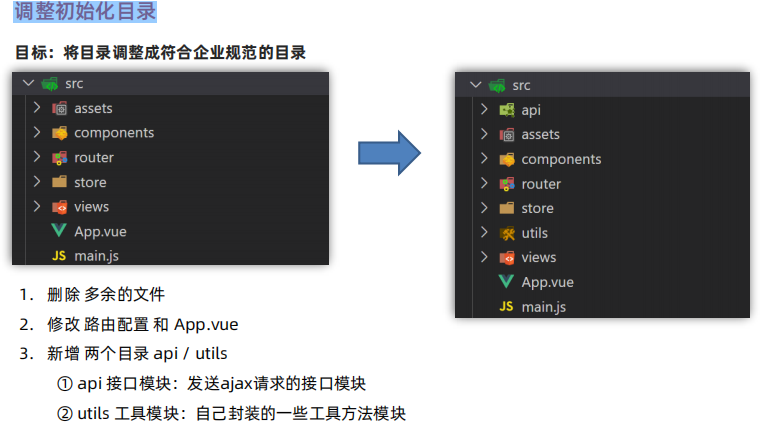
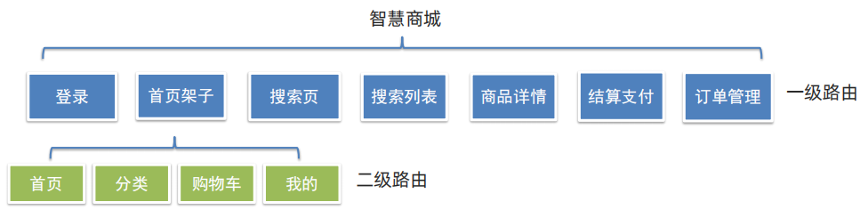
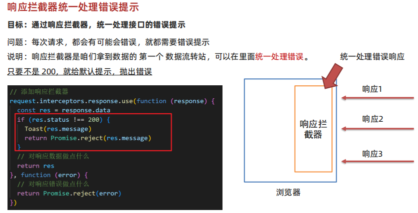
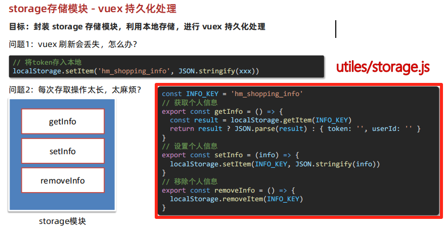
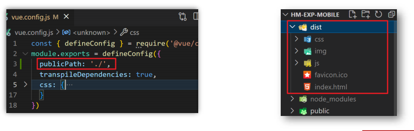

## 智慧商城项目
  ### 项目收获
  - 完整电商购物的业务流 
  - 组件库vant (全部&按需导入) 
  - 移动端vw适配
  - request请求方法封装 
  - storage存储模块封装 
  - api请求模块封装
  - 请求响应拦截器
  - 路由导航守卫
  - 路由跳转传参 
  - vuex分模块管理数据 
  - 项目打包&优化
  - 嵌套路由配置

  ### 调整初始化目录
  - 目标：将目录调整成符合企业规范的目录
  - 步骤：
    1. 删除 多余的文件
    2. 修改 路由配置 和 App.vue
    3. 新增 两个目录 api / utils
       - api 接口模块：发送ajax请求的接口模块
       - utils 工具模块：自己封装的一些工具方法模块
  

  ### Vue 组件库
  - Vue的组件库并不是唯一的，vant-ui 也仅仅只是组件库的一种。
  - 一般会按照不同平台进行分类：
    1. PC端： element-ui (element-plus) ant-design-vue
    2. 移动端：vant-ui Mint UI (饿了么) Cube UI (滴滴)
   
  ### vant-ui
  #### vant 全部导入 和 按需导入
  - 全部导入：一次性导入所有组件，这样打包后的体积会比较大
    1. 安装 vant-ui
       - `yarn add vant@latest-v2`
    2. main.js 中注册
        ```js
        import Vant from 'vant'
        import 'vant/lib/index.css'
        // 把vant中所有的组件都导入了
        Vue.use(Vant)
        ```
    3. 使用测试
        ```html
        <van-button type="primary">主要按钮</van-button>
        <van-button type="info">信息按钮</van-button>
        ```
  - 按需导入：按需导入组件，这样打包后的体积会比较小
    1. 安装 vant-ui (已安装)
      - `yarn add vant@latest-v2`
    2. 安装插件
      - `npm i babel-plugin-import -D`
    3. babel.config.js 中配置
        ```js
        module.exports = {
          presets: [
            '@vue/cli-plugin-babel/preset'
          ],
          plugins: [
            ['import', {
              libraryName: 'vant',
              libraryDirectory: 'es',
              style: true
            }, 'vant']
          ]
        }
        ```
    4. main.js 按需导入注册
        ```js
        import Vue from 'vue'
        import { Button } from 'vant'
        Vue.use(Button)
        ```
    5. 测试使用
        ```html
        <van-button type="primary">主要按钮</van-button>
        <van-button type="info">信息按钮</van-button>
        ```
    6. 提取到 vant-ui.js 中，main.js 导入
      - `import '@/utils/vant-ui' // 导入按需导入的配置文件`

  ### 项目中的 vw 适配
  - 目标：基于 postcss 插件 实现项目 vw 适配
    1. 安装插件
       - `yarn add postcss-px-to-viewport@1.1.1 -D`
    2. 根目录新建 postcss.config.js 文件，填入配置
        ```js    
        // postcss.config.js
        module.exports = {
          plugins: {
            'postcss-px-to-viewport': {
              // 标准屏宽度
              viewportWidth: 375
            }
          }
        }
        ```

  ### 路由设计配置
  #### 路由设计
  - 目标：分析项目页面，设计路由，配置一级路由
  - 但凡是 单个页面，独立展示 的，都是一级路由
  

  #### vant组件使用 - 底部导航 tabbar
  - 导入使用tabbar标签页：
    1. vant-ui.js 按需引入
        ```js
        import { Tabbar, TabbarItem } from 'vant'
        Vue.use(Tabbar)
        Vue.use(TabbarItem)
        ```
    2. layout.vue 粘贴官方代码测试
        ```html
        <van-tabbar>
        <van-tabbar-item icon="home-o">标签</van-tabbar-item>
        <van-tabbar-item icon="search">标签</van-tabbar-item>
        <van-tabbar-item icon="friends-o">标签</van-tabbar-item>
        <van-tabbar-item icon="setting-o">标签</van-tabbar-item>
        </van-tabbar>
        ```

    3. 修改文字、图标、颜色
        ```html
        <van-tabbar active-color="#ee0a24" inactive-color="#000">
        <van-tabbar-item icon="wap-home-o">首页</...>
        <van-tabbar-item icon="apps-o">分类页</...>
        <van-tabbar-item icon="shopping-cart-o">购物车</...>
        <van-tabbar-item icon="user-o">我的</...>
        </van-tabbar>
        ```
  #### 二级路由配置
  - `children` 属性，配置二级路由

### 登录页静态布局

### request模块 - axios 封装
- 目标：将 axios 请求方法，封装到 request 模块
-  使用 axios 来请求后端接口, 一般都会对 axios 进行 一些配置 (比如: 配置基础地址，请求响应拦截器等)
-  所以项目开发中, 都会对 axios 进行基本的二次封装, 单独封装到一个 request 模块中, 便于维护使用

### 响应拦截器统一处理错误提示
- 目标：通过响应拦截器，统一处理接口的错误提示
- 问题：每次请求，都会有可能会错误，就都需要错误提示
- 说明：响应拦截器是咱们拿到数据的 第一个 数据流转站，可以在里面统一处理错误。
- 只要不是 200, 就给默认提示，抛出错误


### storage存储模块 - vuex 持久化处理
- 目标：封装 storage 存储模块，利用本地存储，进行 vuex 持久化处理


### 页面访问拦截
- 目标：基于全局前置守卫，进行页面访问拦截处理
- 路由导航守卫 - 全局前置守卫
  1. 所有的路由一旦被匹配到，都会先经过全局前置守卫
  2. 只有全局前置守卫放行，才会真正解析渲染组件，才能看到页面内容
  ```js
  router.beforeEach((to, from, next) => {
  // 1. to 往哪里去， 到哪去的路由信息对象
  // 2. from 从哪里来， 从哪来的路由信息对象
  // 3. next() 是否放行
  // 如果next()调用，就是放行
  // next(路径) 拦截到某个路径页面
  })
  ```

### 打包发布
- 目标：打包的命令 和 配置
- 说明：vue脚手架工具已经提供了打包命令，直接使用即可。
- 命令：`yarn build`
- 结果：在项目的根目录会自动创建一个文件夹`dist`, dist中的文件就是打包后的文件，只需要放到服务器中即可。
- 配置：默认情况下，需要放到服务器根目录打开，如果希望双击运行，需要配置publicPath 配成相对路径


#### 打包优化：路由懒加载
- 目标：配置路由懒加载，实现打包优化
- 说明：当打包构建应用时，JavaScript 包会变得非常大，影响页面加载。如果我们能把不同路由对应的组件分割成不同的代码块，然后当路由被访问的时候才加载对应组件，这样就更加高效了。
- 步骤1： 异步组件改造
  ```js
  const ProDetail = () => import('@/views/prodetail')
  const Pay = () => import('@/views/pay')
  ...
  ```
- 步骤2： 路由中应用
  ```js
  const router = new VueRouter({
  routes: [
  ...
  { path: '/prodetail/:id', component: ProDetail },
  { path: '/pay', component: Pay },
  ...
  ```
