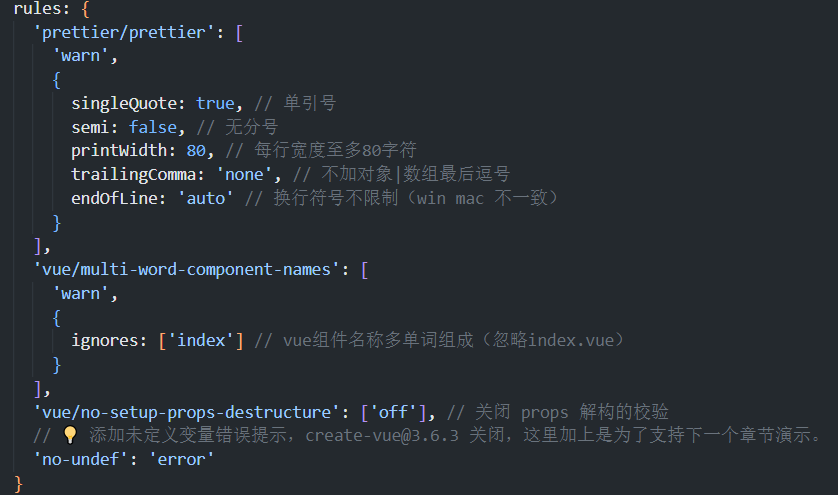
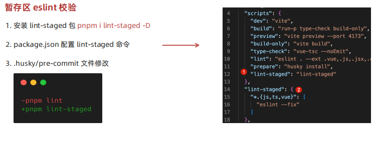
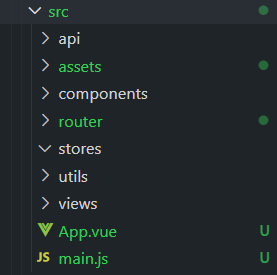

### Eslint 配置代码风格
- 配置文件 .eslintrc.cjs
  1. prettier 风格配置 https://prettier.io
  2. 单引号
  3. 不使用分号
  4. 宽度80字符
  5. 不加对象|数组最后逗号
  6. 换行符号不限制（win mac 不一致）
  7. vue组件名称多单词组成（忽略index.vue）
  8. props解构（关闭）
- 提示：安装Eslint且配置保存修复，不要开启默认的自动保存格式化
|

### 提交前做代码检查
1. 初始化 git 仓库，执行 `git init` 即可
2. 初始化 husky 工具配置，执行 `pnpm dlx husky-init && pnpm install` 即可
   - https://typicode.github.io/husky/
3. 修改 .husky/pre-commit 文件 `npm text -更改-> pnpm lint`

### 暂存区 eslint 校验
1. 安装 lint-staged 包 `pnpm i lint-staged -D`
2. package.json 配置 lint-staged 命令
3. .husky/pre-commit 文件修改 `pnpm lint -更改-> pnpm lint-staged`

### 目录调整
- 默认生成的目录结构不满足我们的开发需求，所以这里需要做一些自定义改动。
- 主要是以下工作：
  1. 删除一些初始化的默认文件
  2. 修改剩余代码内容
  3. 新增调整我们需要的目录结构
  4. 拷贝全局样式和图片，安装预处理器支持
  

### 路由初始化
1. 创建路由实例由 createRouter 实现
2. 路由模式
   1. history 模式使用 createWebHistory()
   2. hash 模式使用 createWebHashHistory()
   3. 参数是基础路径，默认/
- 创建一个路由实例，路由模式是history模式，路由的基础地址是 vite.config.js中的 base 配置的值，
- 默认是 / , 环境变量地址： https://cn.vitejs.dev/guide/env-and-mode.html

### 按需引入 Element Plus 
1. 安装： pnpm add element-plus
2. 配置按需导入：
   - 官方文档： https://element-plus.org/zh-CN/guide/quickstart.html
3. 直接使用组件
4. 彩蛋：默认 components 下的文件也会被 自动注册